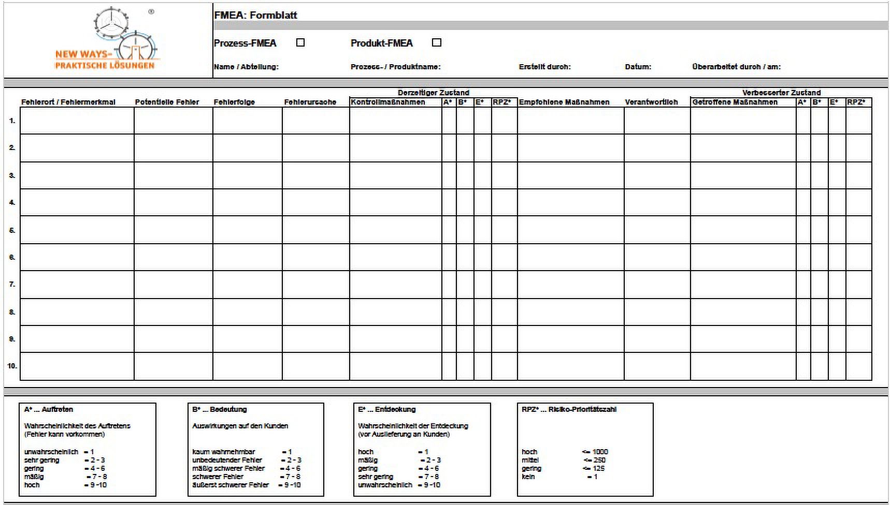

<!----------
title: "Projektmanagement"
date: "Semester 5"
keywords: [Projektmanagement, BWL, DHGE, Semester 5]
---------->

Projektmanagement
=================

<!-- md2apkg ignore-card -->

<!-- START doctoc generated TOC please keep comment here to allow auto update -->
<!-- DON'T EDIT THIS SECTION, INSTEAD RE-RUN doctoc TO UPDATE -->
**Inhaltsverzeichnis**

- [Projektmanagement](#projektmanagement)
- [Klausur (unvollständig)](#klausur-unvollständig)
  - [BWL](#bwl)
  - [Projektmanagement (Klausurschwerpunkte)](#projektmanagement-klausurschwerpunkte)
- [Grundlagen](#grundlagen)
  - [Allgemeine Wiederholung](#allgemeine-wiederholung)
  - [Management Methoden](#management-methoden)
  - [Projektarten](#projektarten)
- [Organisation](#organisation)
  - [Ziele eines Projektes](#ziele-eines-projektes)
  - [Projektfindung/-vorbereitung](#projektfindung-vorbereitung)
  - [Projektrealisierung](#projektrealisierung)
  - [PDCA](#pdca)
  - [Problemermittlung](#problemermittlung)
    - [Ishikawa](#ishikawa)
      - [Die 7-M des Ishikawa Diagramms](#die-7-m-des-ishikawa-diagramms)
      - [Vorteile von Ishikawa](#vorteile-von-ishikawa)
      - [Nachteile von Ishikawa](#nachteile-von-ishikawa)
    - [FMEA-Analyse](#fmea-analyse)
      - [Die Spalten der FMEA-Analyse](#die-spalten-der-fmea-analyse)
      - [Berechnung des Fehlers](#berechnung-des-fehlers)
  - [Prozessvorbereitung](#prozessvorbereitung)
    - [Alternativen durch Kreativtechniken](#alternativen-durch-kreativtechniken)
    - [Erfolgseinschätzung](#erfolgseinschätzung)
      - [Machbarkeitsprüfung](#machbarkeitsprüfung)
      - [Risikoanalyse](#risikoanalyse)
    - [Projektentscheidung](#projektentscheidung)
      - [Was muss entschieden werden? (Projektentscheidung)](#was-muss-entschieden-werden-projektentscheidung)
      - [Was muss beim Projektleiter entschieden werden?](#was-muss-beim-projektleiter-entschieden-werden)
      - [Was muss in der Projektgruppe entschieden werden?](#was-muss-in-der-projektgruppe-entschieden-werden)
      - [Welche formellen Schritte muss jedes Projekt durchlaufen?](#welche-formellen-schritte-muss-jedes-projekt-durchlaufen)

<!-- END doctoc generated TOC please keep comment here to allow auto update -->

<!--newpage-->

# Klausur (unvollständig)

## BWL

<!-- md2apkg ignore-card -->

- SWOT Analyse
- Kundenorientierung (die Kurzfassung reicht)
- Center Organisation
- Berechnung des Personalbedarfs
- Auftragszeit berechnen
- KVP (Kontinuierlicher Verbesserungsprozess)
- interne vs. externe Mitarbeiter-Beschaffung
- ZVEI basiert auf ROI (Grundlage Dupont), unterteilt in 4 Sektoren (2 Ertragskraft, 2 Risiko); keine Berechnungen können, nur beschreiben
- RL: Darstellung (gelb) Bilanz, Controlling (zur Leistungserbringung)
- Dashboard interpretieren
- Balance Score Card erklären und begründen können
- Externes Rechnungswesen (vorgänge beschreiben können, nichts berechnen!)
- Finanzierung - Strategie (Ziele formulieren)
- Abschreibung berechnen (oder Berechnungsverfahren erkennen (linear, degressiv etc.))
- Definition, Inhalt, Ziel von Protektionswirtschaft (in heutiges Leben einordnen können)
- Nutzwertanalyse (evtl. auch in Projektmanagement)

## Projektmanagement (Klausurschwerpunkte)

<!-- md2apkg ignore-card -->

- Projekt und Projektmanagement erläutern können
- Kennzeichen/Merkmale von Projektmanagement erläutern können (Folie 4)
- Knotennetzplan
- Grundsätze für die Projektplanung (Folie 17)
- PDCA anwenden und beschreiben können
- Problemanalyse (Folie 22)
- Ishikawa
- Brainwriting nach 635 Methode
- Kompetenz kann "etwas können" oder "etwas dürfen" bedeuten, aus dem Kontext deuten können!
- Knoten-Netzplan (Ablauf von Projekten) berechnen können (!!!)

# Grundlagen

> Die Durchführung eines Projektes besteht aus dem Projekt selbst und dem Projektmanagement

- **Projekt:** risikobehafteter, hoch komplexer Gegenstand einer Handlung (Ziel/Aufgabe) mit begrenzten Ressourcen (HR, MR, FR) in einem bestimmten Zeitrahmen
- **Projektmanagement:** Organisation von Ablauf, Abrechnung und Dokumentation der Umsetzung eines Projektes
- **Kontinuierlicher Verbesserungsprozess** (KVP) durch Markt (Wettbewerb, Kunde) und technisch-technologischen Fortschritt getrieben
- Verantwortung: Übernahme der Aufgabenerfüllung $\rightarrow$ Folgen: Tadel, Lob

<!--
Mögliche Klausuraufgabe: Was zeichnet ein Projekt aus?
Eher Random: Qualität eines Mitarbeiters: fachliche, methodische und persönliche Kompetenz
-->

## Allgemeine Wiederholung

- KVP bewegt durch Markt (Wettbewerb, Kunde) und technisch technologischen Fortschritt
- Ressourcen: HR, MR, FR (human, material und financial resources)
- Verantwortung: Übergeben, Übernommen $\rightarrow$ Aufgabenerfüllung
  - Folge von Verantwortung: Tadel oder Lob (beides wichtig, jedoch nicht inflationär)
- Teile des Marketings: Preis (Kontrahierungspolitik), Verteilung (Distribution), Produktpolitik, Kommunikation
- Lean Management: flache Hierarchie

## Management Methoden

- Effektivität (*Ist die Maßnahme zielführend?*) und Effizienz (Aufwand/Nutzen-Verhältnis)
  - wichtig für einheitliche Planungsmethoden
- einheitliche Standards zur Vergleichbarkeit

<!--Kontennetzplan vllt in Klausur-->

- Planungsmethoden: Knotennetzplan, Vorgangspfeilnetzdiagram, Flussplan, Ganttdiagramm, Workflow
- Anforderung an Planungsstandard:
  - Kausalität (Ursache $\rightarrow$ Wirkung, abhängig zueinander)
    - vgl. Korrelation: zwei Ereignisse entwickeln sich parallel [ohne Bezug zueinander](http://tylervigen.com/spurious-correlations)
  - Übersichtlichkeit
  - Transparenz
  - Vollständigkeit
  - Zweckbestimmtheit: jedes Projekt hat seine eigenen Vorgaben

## Projektarten

- ausrichtungsbezogen:
  - revolutionär: neue Idee; gewollte Schritte, bewusst angeregt (z.B. Glühbirne)
  - evolutionär: kleine ungewollte Schritte $\rightarrow$ Weiterentwicklung einer Idee (Entwicklung) oder Verbesserung/Optimierung einer Idee (Rationalisierung)
    - z.B.: Sensomotorik beim Menschen
  - expansiv: Vergrößern/Ausweiten einer Idee (Objekte)
    - z.B.: zusätzliche Produktionsanlagen bauen, neue Märkte erschließen
  - Forschung: z.B. Trial and Error
  - Entwicklung: z.B. Rennrad als Weiterentwicklung des "normalen" Fahrrads
- ausstattungsbezogen:
  - personell: eine/mehrere Personen
  - Vollzeit: begrenzte hauptamtliche Tätigkeit
  - Teilzeit: parallel zur derzeitigen Tätigkeit
- trägerbezogen:
  - eigene Projekte: im eigenen Unternehmen
  - fremde Projekte: für ein anders Unternehmen bzw. durch ein anderes Unternehmen
  - Mischprojekte: eigene und fremde Kräfte wirken gemeinsam
- funktionsbezogen:
  - Materialwirtschaft: Supply Chain Management (bspw.: Schreiner muss Holz beschaffen)
  - Fertigung: ein Projekt zur Optimierung der Produktion (bspw. energiersparenderer Prozess)
  - Marketing (Preis-, Verteilungs- Produkt-, Kommunikationspolitik)
  - Verwaltung: Umstellung von Fax auf ein Vorgangsbearbeitungssystem (Echtzeitsystem)
  - Kombination

# Organisation

## Ziele eines Projektes

- strategisch (> 3/5 Jahre): langfristige, grundlegende Ziele
- taktisch (< 3/5 Jahre, >1 Jahr): mittelfristige Teilziele
- operativ (<1 Jahr): kurzfristige Prozesssteuerung
- Ziel (SMART): **S**pezifische Sache, **M**essbare Größenordnung, **A**ktualität, **R**ealistisch (erfüllbar), **T**erminierung (A,R = Bedingungen)

## Projektfindung/-vorbereitung

- **Zielfindung/-bildung:** Benchmarks, Trends, ...
- **Problemanalyse:** Ishikawa (Ursache/Wirkungs-Diagramm), FMEA (Fehlermöglichkeits- und -einflussanalyse), ...
- Finden von **Alternativen:** Plan B, Kreativtechniken (Brainstorming)
- **Prognose:** Extrapolation, Szenarien, Modelle
- **Bewertung:** Nutzwertanalyse <!--Nutzwertanalyse könnte in der Klausur gebraucht werden-->

## Projektrealisierung

- **Start:** Kick off $\rightarrow$ Bekanntgabe des Projektes
- **Definitionsphase:** Ziel und Aufgabe (SMART, Operationalisierung (Muss-, Soll-, Kann-Ziele))
- **Planungsphase:** Netzplantechnik (Pakete, ...)
- **Umsetzungsphase:** Realisierung
- **Bewertung:** Kennzahlen, BSC

## PDCA

- **PLAN:** Prozess planen; Aufgabe und Zielstellung, Analyse des aktuellen Zustands und Entwicklung eines Konzeptes (Plan)
- **DO:** begrenzter Test
- **CHECK:** Überprüfen und Analyse der gesammelten Daten
- **ACT**

<!--Klausur: Anwendung und Beschreibung des PDCA für ein Projekt = 8 Punkte -->

## Problemermittlung

- Ursachenermittlung: Ishikawa, FMEA
- Fehlerermittlung: FMEA
- Zukunftsermittlung: FMEA

### Ishikawa

- Betrachtung der sieben Ms: Mensch, Maschine, Methode, Milieu (Umfeld), Material, Messung, Management
- Faktoren können je nach Anwendung variieren
- Ursache-Wirkungs-Diagramm
- 3 Vorteile und 3 Nachteile sollen gekonnt sein!

#### Die 7-M des Ishikawa Diagramms

- **M:** Mileau
- **M:** Methode (Technologie)
- **M:** Maschine
- **M:** Mensch
- **M:** Management (Führungsprozess)
- **M:** Messung
- **M:** Material

#### Vorteile von Ishikawa

- Fördert Kreativität bei der Suche nach Ursachen
- Ordnet mögliche Ursachen in Kategorien
- Erarbeitung im Team ermöglicht neue Perspektiven
- Kausalitäten von Ursachen werden dargestellen
- Ermutigt Mitarbeiter zum Einbringen von Ideen
- Vereinfacht das Problem
- Einfache Anwendung und Erlernbarkeit

#### Nachteile von Ishikawa

- Erfordert Diziplin und Vereinfachung, damit das Diagramm nutzbar bleibt
- Vorgefertigte Kategorien (z. B. 5M) können kreative Problemlösungswege einschränken
- Komplexe Zusammenhänge lassen sich im Ishikawa-Diagramm nicht darstellen
- Liefert keine Lösungen, sondern visualisiert nur die Ursachen

### FMEA-Analyse

<!--width=200px-->

- Punktesystem, Verbesserung/Verschlechterung kann bemessen werden
- Ziel: Fehler finden, bevor der Kunde sie bemerkt

#### Die Spalten der FMEA-Analyse

- **Fehlerort/Fehlermerkmal:** Wo tritt der Fehler aus?
- **Potentielle Fehler**
- **Fehlerfolge:** Was ist das Resultat des Fehlers?
- **Fehlerursache:** Aus welchem Grund tritt der Fehler auf?
- **Kontrollmaßnahmen:** Wie wurde der Fehler ermittelt?
- A, B, E, RPZ $\rightarrow$ siehe [Berechnung des Fehlers](#berechnung-des-fehlers)
- **Empfohlene Maßnahme:** Welchem Maßnahmen könnte man durchführen, um den Fehler zu beseitigen?
- **Verantwortlich:** Wer ist für die Maßnahmen verantwortlich?
- **Getroffene Maßnahmen:** Was wurde tatsächlich getan?

#### Berechnung des Fehlers

- **(A) Auftreten:** Wahrscheinlichkeit des Auftretens: Vergeben von Punkten (1-10)
  - unwahrscheinlich = 1
  - sehr gering = 2-3
  - gering = 4-6
  - mäßig = 7-8
  - hoch = 9-10
- **(B) Bedeutung** des Fehlers / Auswirkungen auf den Kunden
  - kaum wahrnehmbar = 1
  - unbedeutender Fehler = 2-3
  - mäßig schwerer Fehler = 4-6
  - schwerer Fehler = 7-8
  - äußerst schwerer Fehler = 9-10
- **(E) Entdeckung**: Wahrscheinlichkeit der Entdeckung (vor Auslieferung an den Kunden)
  - hoch = 1
  - mäßig = 2-3
  - gering = 4-6
  - sehr gering = 7-8
  - unwahrscheinlich = 9-10
- **RPZ:** Risiko-Prioritätszahl
  - hoch <= 1000
  - mittel <=250
  - gering <= 125
  - kein = 1
- A, B und E werden für jeden Fehler miteinander multipliziert, daraus ergibt sich die RPZ
- je höher RPZ, desto wichtiger ist es den Fehler zu behandeln $\rightarrow$ Priorisierung nach RPZ
- danach können die Fehler in dieser Reihenfolge nach Ishikawa behandelt werden

## Prozessvorbereitung

### Alternativen durch Kreativtechniken

- Brainstorming
- **Brainwriting:** - 635 Methode (Strukturierung des Brainwritings)
  - **1. Möglichkeit:** 6 Gruppen oder 6 Teilnehmer | je 3 Ideen aufschreiben | 5 Minuten Zeit $\rightarrow$ 18 Ideen | Mehrfachnennungen sind möglich
  - **2. Möglichkeit:** 6 Gruppen oder 6 Teilnehmer | je 3 Ideen | 5 Minuten Zeit | umlaufend 6 Durchgänge (Gruppen sehen und ergänzen Ideen der anderen Gruppen vor der Auswertung) $\rightarrow$ 108 Ideen | Mehrfachnennungen sind möglich
  - **3. Möglichkeit:** 6 Gruppen oder 6 Teilnehmer | je 3 Ideen | 5 Minuten Zeit | umlaufend, aufbauend 6 Durchgänge (Ideen werden weitergegeben, Ideen müssen von der nächsten Gruppe erweitert werden) $\rightarrow$ 18 Ideen | Mehrfachnennungen sind unwahrscheinlich
- **Morphologischer Kasten:**
  - "Konfigurator"
- **Mindmapping:** Graphische Darstellung von Sachverhalten
- **Bionic:** Inspiration für die Problemlösung in der Natur suchen
- ...

### Erfolgseinschätzung

#### Machbarkeitsprüfung

- **Ressourcen:** HR, MR und FR
- **Zeit:** Zeitpunkt, Dauer
- **Raum:** Ort, Umweltverträglichkeit
- Machbarkeitsstudie: 3 Säulen bestehend aus: soziale Beziehungen, Ökonomie, Ökologie
  - Schnittmenge aus den 3 Säulen bedeutet: Nachhaltigkeit

#### Risikoanalyse

- jedes Projekt kann scheitern
- die Risikoanalyse ermittelt: Wann soll das Problem abgebrochen werden? Ab wann lohnt es sich nicht mehr?
- Es wird eingeschätzt nach: Wahrscheinlichkeit des Stattfindens (häufig bis unvorstellbar) und der Auswirkung/Ausmaß (unwesentlich bis katastrophal)
- Kombination aus Wahrscheinlichkeit und Ausmaß ergeben die Risikobewertung: akzeptiert, kritisch oder inakzeptabel

### Projektentscheidung

#### Was muss entschieden werden? (Projektentscheidung)

- **Projektleiter:** muss fachliche, methode und persönliche Kompetenzen haben (wie jeder Mitarbeiter)
- **Projektgruppe:**
  - Quantität: Welche, wie viele (zu welcher Zeit und an welchem Ort) Mitarbeiter?
  - Qualität: fachliche, methodische und persönliche Kompetenzen (wie jeder Mitarbeiter)
- **Institutionen:** welche uns in der Bewältigung unserer Probleme brauchen (bspw. Großrechner zur Klimasimulation)
- **Experten:** interne und externe (bspw. Berater für das betriebliche Gesundheitsmanagement)
- **Einbindung in die Organisation:** Wie sieht das Organigramm aus? Wie fügen sich alle Teile in die Organisation ein?
- **Controlling:** Dienstleister für die Erfolgskontrolle
  - müssen die Daten genau so vorbereiten, wie sie gebraucht werden
  - treffen **keine** Entscheidungen!

#### Was muss beim Projektleiter entschieden werden?

- **Aufgabe:**
  - Definition des Inhalts: Wer? Was? Wann? Warum? Wo? Wie? $\rightarrow$ 5-W Regel
  - Unterschiedliche Definition eine W's $\rightarrow$ Konfliktpotential
- **Ziele:** siehe [Ziele eines Projektes](#ziele-eines-projektes)
- **Befugnisse:**
  - Kompetenz (etwas können): fachlich, methodisch, persönlich
  - Kompetenz (etwas dürfen): Befugnis
  - Der Mitarbeiter muss mit Befugnissen umgehen können
  - zu wenige Befugnisse verlangsamen den Prozess
- **Verantwortung:** Pflicht der Aufgabenerfüllung (siehe [Allgemeine Wiederholung](#allgemeine-wiederholung))
- **Anforderungen:** Muss fachlich, methodisch und persönlich die Aufgabe bewältigen können.

#### Was muss in der Projektgruppe entschieden werden?

- **Aufbau/Struktur:** Wie viele Mitarbeiter? Welche Hierarchien (bei größeren Projektgruppen)?
- **Gruppenarbeit:**
  - Entwicklung der Gruppe in 5 Phasen:
    1. Kennenlernen, Zusammenstellung $\rightarrow$ Forming
    2. Rangordnunug, Rollen festlegen $\rightarrow$ Storming
    3. Qualität und Quantität oder Aufgabenerfüllung $\rightarrow$ Norming
    4. Doing, Erfüllung, höchste Leistungsfähigkeit $\rightarrow$ Performing
    5. Verarbschiedung, Auflösung $\rightarrow$ Adjourning
- **Gruppenarten:**
  - Art des Projekts
  - Art der Berufung
  - Nach der Leitung
  - Nach der Veränderlichkeit
  - Strukturierung
- **Qualifikation der Mitarbeiter:** Wer muss welche Qualifikationen haben?
  - stehen im Anforderungsprofil der Stellenausschreibung

#### Welche formellen Schritte muss jedes Projekt durchlaufen?

1. Formeller Projektauftrag
2. Formelle Projektorganisation
3. Formelle Projektrichtlinien
4. Formelle Projektplanung
   1. Ganttdiagramm (Meilensteine)
   2. Workflow
   3. Flussplan
   4. Netzplantechnik (Meilensteine, Ressourcen) \rightarrow\rightarrow Pfeilnetzplan, Notennetzplan
5. Formelle Projektdokumentation
6. Daten, die während der Projekts erhoben wurden, aufschreiben

- Auftraggeber wendet sich an den Projektleiter
- Projektleiter ist für das gesamte Projekt verantwortlich
- Teile des Projekts werden von Projekt-Managern bearbeitet
- den Projektmanagern sind jeweils Projekt-Mitarbeiter untergeordnet
- $\rightarrow$ Folie 39: klassisches Einliniensystem
