# GDV-Glossar

## Additive Farbmischung

- Farben leuchten selbst
  - wenn alle leuchten $\rightarrow$ weiß
  - keine leuchten $\rightarrow$ schwarz

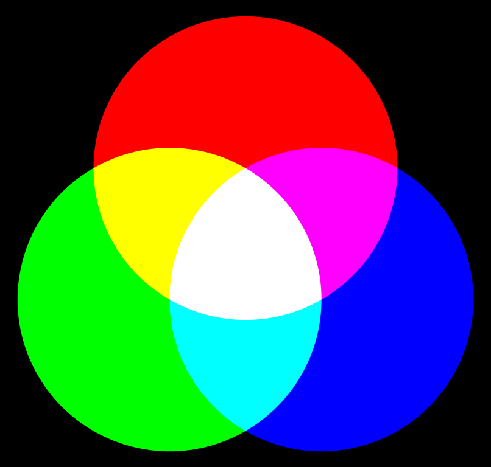

## Additive Manufacturing

> = 3D-Druck $\rightarrow$ Rapid Prototyping

## Aliasing

> **Problem:** Rasterung in der Computergrafik. Ausgabe fast ausschließlich über Rastergeräte (Monitior, Drucker)

- **Treppeneffekt** wird durch **Antialiasing** entgegengewirkt
  - Vor- und Nachfilterung, Flächenabtastung
- Antialiasing wird auch in Hardware implementiert (Full-Scene Antialiasing - FSAA)

> Alternativ: **Alias-Effekt**

## Alphakanal

- definiert **Transparenz** einzelner Bildpunkte
- nicht von allen Datenformaten für Pixelbilder unterstützt

## Ambient Occlusion

- Verfahren zur Approximation realistischer Verschattung von Szene
- geringe Rechenzeit aber physikalisch nicht korrekt

> Alternativ: **Umgebungsverdeckung**

## Splines

> B-Spline, Bézierkurve, ...

- in CAD & DCC-Systemen
- Funktionen, die stückweise aus Polynomen höchstens n-ten Grades zusammengesetzt sind
- beschreiben u. a. Schriftarten in der Computergrafik

## Beleuchtungsmodell

> Unterscheidung in lokale und globale Beleuchtungsmodelle

- **lokale Modelle:** Phong, Blinn
- **globale Modelle:** Raytracing, Ausbreitung von Licht einer Szene

> Bedeutend für Bildsynthese (Grafik aus Rohdaten erzeugen)

## Bildformate

> `JPG`, `PNG`, `BMP`, `GIF`, `WebP`

## Bildraum

- die Abbildung von Inhalten aus dem Objektraum auf einer Ebene
- in der CG dazu nötig: Verarbeitung von (3D)-Informationen des Objektraums um sie z.B. auf dem Bildschirm darstellbar zu machen
  - dabei gehen Informationen über die Objekte verloren

## Boolsche Operatoren

Werden verwendet, um Formen miteinander zu vereinigen und so neue Formen zu erzeugen.
Zur Anwendung kommen:

- Vereinigung OR
- Differenzmenge "A\\B" (NOT?)
- Schnittmenge AND

## Boundary Representation (BREP)

- exakte Geometrie z.B. in Dateiformaten für den Datenaustausch (z.B. JT, STEP)
- Darstellungsform eines Flächen- oder Volumenmodells in der Objekte durch begrenzte Oberflächen beschrieben werden

> Alternativ: **B-REP**

## CAD

- **C**omputer-**a**ided **D**esign
- Unterstützung von konstruktiven Aufgabe mittels EDV
- Weitere Unterteilung: MCAD (Mechanik), ECAD (Elektronik)

### CAD-Systeme nach Hersteller

- Autodesk: AutoCAD, Inventor
- Siemens: NX, Solid Edge
- Dassault Systemés: CATIA
- PTC: Creo

### Aufbau von CAD- und DCC-Software

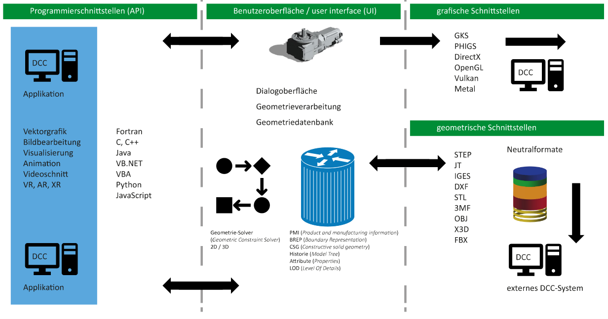

## CAE

- **C**omputer-**a**ided **E**ngineering
- Rechnergestützte Entwicklung (CAD)
- alle Varianten der Rechner-Unterstützung von Arbeitsprozessen in der Technik (Wikipedia)
- Analyse der entworfenen Visualisierung z.B. für Anwendung für Thermodynamik, Belastungsanalyse, Flussanalyse von Flüssigkeiten durch die Bauteile

## CAM

- **C**omputer-**a**ided **M**anufacturing
- Teilaspekte der Fertigungstechnik bzw. Arbeitsvorbereitung (z.B. Erstellung von NC-Programmen)

## CG

- **C**omputer **G**raphics
- Umwandlung von Daten des Objektraums in grafische Daten des Bildraumes

## CIE-Farbwertdiagramm

> Das gebogene Dreieck umfasst alle wahrnehmbaren Farben unter Vernachlässigung der Leuchtdichte. Nur wenn sich zwei Farben in ihrer Farbigkeit (Farbton und/oder Sättigung) unterscheiden, werden sie durch zwei unterschiedliche Punkte dargestellt.

## Clipping

> Zuschneiden transformierter Objekte

- 2D-Bereich: z.B. Ansichtsfenster
- 3D-Bereich: in Form eines Clippingvolumens (Transformation von Weltkoordinaten in normalisierte Ansichtskoordinaten)
- Probleme z. B. im 3D-Umfeld (Spiegelungen, Schatten, ...)

## Computer Vision

- Verarbeitung und Analyse von Bildern, um:
  - Inhalt zu verstehen
  - geometrische Informationen zu extrahieren (Umwandlung: Bildraum $\rightarrow$ Objektraum)
- z.B. Objekterkennung, Vermessung geometrischer Strukturen (3D-Scan)

## CSG

> **C**onstructive **S**olid **G**eometry

- Technik zum Modellieren von Körpern
- Grundlage: Kombination von Grundkörpern durch **boolesche Operatoren**

## DCC

> **D**igital **C**ontent **C**reation

- Erstellung von multimedialen Inhalten
- Zusammenfassung verschiedenster Technologien

## Digitale Prozesskette

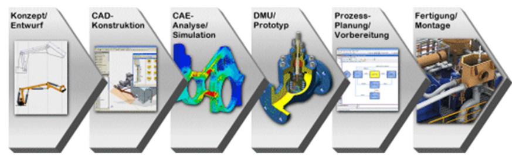

## Digitale Transformation

Der fortlaufende, durch digitale Technologien begründete gesamtgesellschaftliche Veränderungsprozess.
Betrachtet werden vor allem Auswirkungen auf Wirtschaft und Industrie.

## Digitaler Zwilling

- digitale Repräsentation eines Objektes aus der realen Welt in der digitalen Welt
- Datenaustausch zwischen den Zwillingen ist häufig gegeben (Aktualität)
- Beispiele:
  - Track and Trace in der Logistik
  - Anwendungen im PLM

## Dithering

- Erzeugen der Illusion einer größeren Farbtiefe
- Nachbildung von fehlenden Farben durch bestimmte Pixelanordnung

## e-collaboration

Beschreibt die Maßnahmen zur dezentralen computergestützten Zusammenarbeit von zeitlich und/oder räumlich getrennten Teams und Gruppen, die an einer gemeinsamen Aufgabe arbeiten.

Hier: arbeiten gemeinsam an einem Produkt.

> Quelle [Wikipedia: e-collaboration](https://de.wikipedia.org/wiki/E-Collaboration)

## ERP

**E**nterprise **R**esource **P**lanning beschreibt Softwarelösungen zur Ressourcenverwaltung und -planung in einem Unternehmen oder einer Organisation.

Es integriert eine Vielzahl von Geschäftsanwendungen und Betriebsdaten für die Verwaltung in einer zentralen Datenbank.

Hier werden vor allem personelle und finanzielle Ressourcen verwaltet. **PPS**-Systeme können ggf. integriert werden.

## Farbmodell

- z.B. `RGB`, `CMYK`, `HSV`, `HSL` ...
- definieren eine abstrakte Darstellung von Farben $\rightarrow$ Berechenbarkeit
- innerhalb der Modelle sind allen Farben eindeutigen Zahlenwerten zugeordnet

<!-- ToDo: HSV und HSL -> Sechseckige Pyramide eventuell -->

## Farbwahrnehmung (Begriffe)

- **Leuchtdichte:** Helligkeit
- **Farbton:** dominante Wellenlänge
- **Sättigung:** Erregungseinheit

## Farbprofil

> ICC-Farbprofil: gerätespezifisch, Ziel der Realisierung einer durchgängigen Absicherung der Farbwiedergabe über die Systemgrenzen hinweg (Farbmanagement)

## Farbraum

- Alle Farben eines Farbmodells
- durch Menschen wahrnehmbaren Farben vs. durch technische Systeme realisierbare Farben

## Farbtiefe

- Anzahl der Bits/Bytes zur Codierung der Farben
- Differenzierung aller Helligkeits- und Farbwerte

## Feature Modellierung

- Verwenden von Features zu Konstruktionszwecken in der Modellumgebung
- Features = konstruktive Aspekte als Einheit (Eltern-Kind-Beziehung)
- $\hookrightarrow$ neben geometrischem Informationsgehalt auch technologische, fertigungstechnische oder qualitätsbezogene Aspekte

### Beispiele für Feature-Modellierung

- Rundung (hinzufügen/abtragen)
- Fase (hinzufügen/abtragen)
- Bohrung (abtragen)
- Welle (hinzufügen)

## Freiheitsgrade

- Möglichkeiten zur Änderung geometrischer Elemente (z.B. in Skizzen, oder Einzelteile in Baugruppen)
- Auch z.B. bei möglichen Bewegungen von Robotern oder Werkzeugmaschinen

> Alternativ: **DoF - Degree of Freedom**

## Gammakorrektur

- Korrektur nichtlinearer Kennlinien in Anpassung an das menschlichen Empfinden
- Kalibriert die Intensität der Anzeige, nicht die Farben

## Geometrische Schnittstelle

- Realisierung des Datenaustauschs z.B. bei CAD- und DCC-Systemen
- Beispiele CAD: `JT`, `STEP`, `IGES`
- Beispiele DCC: `JT`, `FBX`, `OBJ`

<!-- ToDo: Aus welchen geometrischen Elementen ist eine komplexe Geometrie aufgebaut? -->
<!-- ToDo: Step als Bsp eventuell genauer -->

## Grafikpipeline

> Schritte zur Umsetzung einer Grafischen Darstellung aus dem zwei- oder dreidimensionalen Raum

- Koordinatensysteme
- Definition des Objektes
- Tesselation
- Transformationen
- Perspektiven
- Clipping
- Rasterisierung
- Shader

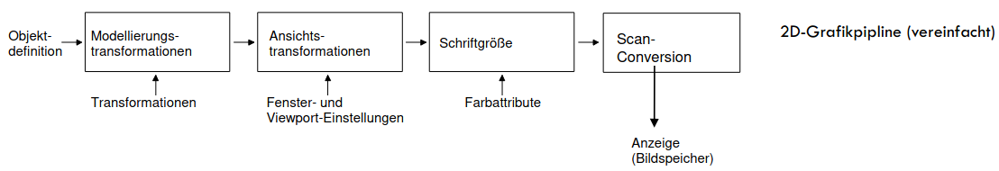
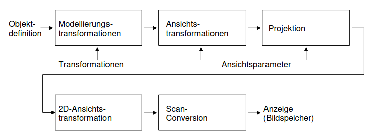

> Alternativ: **Rendering Pipeline**

## Grafische Schnittstelle

- Plattform- und programmiersprachenübergreifende Programmierschnittstelle zur Entwicklung von 2D- und 3D-Computergrafikanwendungen
- Beispiele: `DirectX`/`Direct3D`, `OpenGL`, `Vulkan`, `Metal`

## Graphisches Kernsystem (GKS)

- erster Standard für Computergrafik

> Alternativ: **Graphic Kernel System**

## High Dynamic Range Image (HDRI)

- Bilder mit einem vergrößertem Dynamikumfang
- z.B. zur Nutzung im Rahmen von Image-based Lighting (IBL)

## Historiengraph

Historiengraph (Modellbaum) beschreibt die vollständige Geometrie und auch die "Entstehungsgeschichte" der Objekte, enthält "Know-how des Konstrukteurs"

## Image-based Lighting (IBL)

- Bildbasierte Beleuchtungsverfahren für realistischere Beleuchtung
- meist auf Basis von 360°-Bildern (möglichst HDR-Images)

## Immersion

Der Grad, mit dem eine virtuelle Umgebung als real empfunden wird. Wird durch enstprechende Hardware (VR-Brillen, Interaktionsequipment, ...) erhöht.

## indizierte Farben

- Datenstruktur jedes Pixels enthält Index eines Eintrages einer Farbtabelle (nicht direkt einzelne Farbwerte!)
- vor allem für Bilder/Formate mit wenigen Farbwerten verwendet

> Alternativ: **Farbpalette**

## Industrie 4.0

- steht für die vierte industrielle Revolution
- Technische Grundlage hierfür sind **intelligente und digital vernetzte Systeme**
- Prinzipien:
  - Vernetzung
  - Informationstransparenz
  - technische Assistenz
  - dezentrale Entscheidungen

## Integriertes Produktdatenmodell

- Produktdefinition
  - Identifikation, Klassifikation
  - Freigabe und Änderungszustände
- Produktrepräsentation: Eigenschaften über Merkmale ausgedrückt
  - Geometrie, Topologie
  - FEM, Kinematik usw.
- Produktpräsentation: Darstellung der Repräsentation
  - Grafisch, textuell, zeichnerisch
  - Multimedial, Animationen usw.

- i. Produktdatenmodell ist Grundlage für PDM
  - Applikationen (CAD,CAE,CAM,CAx) an PDM-System angeschlossen
  - Daten liegen in PDM, System, gemeinsamer Zugriff über Benutzeroberfläche
  - vgl. 3-Schichten-Architektur

### Bestandteile des Integrierten Produktdatenmodells

- 2D- und 3D-CAD-Daten (z.B. Einzelteile, Baugruppen, parametrische Beziehungen sowie Element-, Standard- und Normteil- Bibliotheken)
- Zeichnungsdaten (z.B. aus dem 3D-CAD-System abgeleitete Einzelteil- und Zusammenbau-Zeichnungen, gescannte 2D- Zeichnung)
- Stücklisten und Auftragskopfdaten
- Arbeits- und Montagepläne, NC-Datensätze und Prüfpläne
- Werkzeug- und Betriebsmitteldaten
- Projektplanungsdaten
- Methoden

## Internet of Things

Das Netzwerk physischer Objekte, die z.B. per Sensoren Daten sammeln und per integrierter Software über das Internet mit anderen Objekten Daten austauschen.

> Alternativ: **IoT**

## JT

- ISO-Standard-Grafikformat für 3D-Daten
- erweitert CAD um:
  - PMI (Toleranz- und Fertigungsinformationen)
  - CAD-Parameter und Attribute
  - exakte BREP: Boundary Representation
  - Facettierung mit schnellem Laden auch für große Baugruppen

## Kernelmodellierer

- Modellierkern (geometric modeling kernel)
- Bsp.: ACIS, Parasolid
- 3D solid modeling software component für CAD

## Komprimierung (Bildkompression)

> verlustfreie oder verlustbehaftete Komprimierung in Dateiformaten (speziell für Pixelgrafiken)
> z.B. RLE, JPEG oder Wavlet

## Koordinatentransformationen

- Koordinaten eines Punktes in einem Koordinatensystem, dessen Koordinaten in einem anderen Koordinatensystem berechnet werden

wir behandeln:

- Translation
- Rotation
- Skalierung
- Spiegelung
- Scherung

## Leuchtdichte (Luminance)

"Die Leuchtdichte beschreibt die Helligkeit von ausgedehnten, flächenhaften Lichtquellen; für die Beschreibung der Helligkeit von punktförmigen Lichtquellen ist die Lichtstärke besser geeignet."

## Level of Detail (LOD)

- auch Verwendung in `JT`-Format für Datenaustausch (siehe Tesselierung)
- verschiedene Detailstufen bei der Darstellung virtueller Welten

## Lichtquellen (Lichttypen)

- verschiedene Lichtausbreitungsberechnungen (Energieerhaltung)
- z.B.: Richtungslicht, Punktlicht, Spotlicht, Umgebungslicht (s. Image Based Lighting)

## Material-Beschreibung

> Parameter zur Beschreibung der optischen Eigenschaften eines Werkstoffs

- abhängig vom eingesetzten Berechnungsverfahren (Renderer)
- Anforderungen an den Datenaustausch (siehe Geometrische Schnittstellen)
- neue Anforderungen für Echtzeitvisualisierungen
- einfache Modelle z.B. für Phong-Beleuchtungsmodell und Phong-Shading
- Wechsel zu physikbasierten Materialbeschreibungen z.B. MDL

## Mechatronik

**Mechatronik** bezeichnet das interdisziplinäre Zusammenwirken von Mechanik/Maschinenbau, Elektronik/Elektrotechnik und Informatik (und weiteren).

Quelle [Wikipedia: Mechatronik](https://de.wikipedia.org/wiki/Mechatronik)

## Metaball-System (blob oder BlobMesh)

- Spezielle Modellierungsmethode auf Basis von Kugeln als Grundelement
- Kugeln besitzen spezielle Eigenschaften welche mit der Oberflächenspannung von Wassertropfen verglichen werden können

## Metadaten (Attribute, Eigenschaften)

- Zusätzliche Informationen z.B. in Dateien (3D-Modelle, Pixelbilder)
- Beispiel Fotos: EXIF
- siehe geometrische Schnittstellen (z.B. JT, STEP)
- Ablage auch in Datenbanksystemen z.B. für PDM, PLM und Assetmanagement

## NC

> **N**umerical **C**ontrol

- Bearbeitung vollautomatisch und hochpräzise erledigen

## Objektraum

- Definition von 2D- und/oder 3D-Geometrie

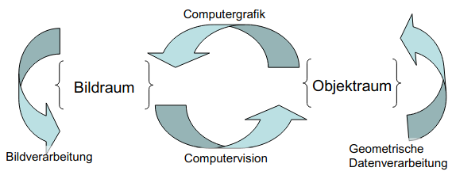

## PEP

**P**rodukt**e**ntstehungs**p**rozess: Darstellung und Beschreibung der Arbeitsabläufe von der Produktidee bis Herstellung und Verkauf.
Normung nach DIN.

## Phong-Beleuchtungsmodell

- einfaches Modell zur Berechnung der Schattierung von Oberflächen
- drei Komponenten: diffuse, spekuläre und ambiente Reflektion
- für Darstellung von glatten, plastikähnlichen Oberflächen geeignet
- keine physikalische Grundlage
- trotzdem Dank seiner Einfachheit hohe Beliebtheit

## PLM (Product-Lifecycle-Management)

**P**roduct **L**ifecycle **M**anagement ist ein Management-Ansatz zur Verwaltung aller Daten, die im Lebenszyklus eines Produktes anfallen.
PLM kann durch EDV unterstützt werden, wobei die Daten schnell und zentral bereitgestellt werden sollen.
Integration in oder Schnittstellen zu anderen Systemen wie ERP sind sinnvoll, da Daten der CAD, CAE, CAM, ERP, PDM, ..., hier zentral verwaltet werden sollen.

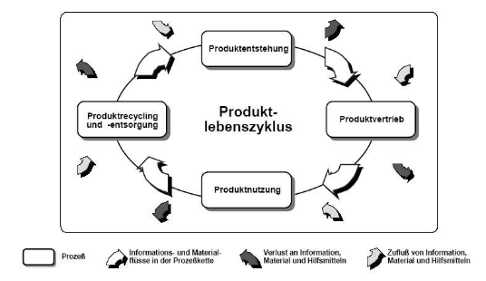

### Einordung von Konstruktion im PLM

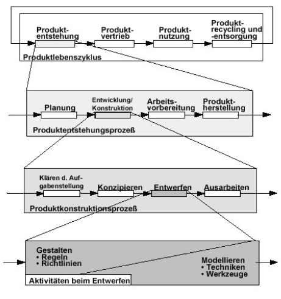

### PLM-Systeme

<!--ToDo: Beispiele einfügen -->

## PDM

- Produktdatenmanagement
- $\text{PDM}\subset\text{PLM}$

### Ziel eines PDM- bzw. PLM-Systems

> Unternehmen erhoffen sich vom PLM eine verbesserte Kontrolle über die diversen Prozesse, die in jedem Teil eines Lebenszyklus erforderlich sind, und damit auch transparente Aufwände und Erträge.

- Verkürzung des Zyklus in bestimmten Teil-Bereichen
- Optimierung der Effizienz der Herstellung
- Verminderung von Kosten
- Wegfall redundanter Datenerfassungen im Unternehmen

### Anforderungen an PDM

<!--ToDo andere aus Bild übernehmen-->

- Konsistenz bei Änderungen muss erhalten bleiben
- Freigabe und Änderungen müssen organisiert werden
- Rückverfolgbarkeit (back tracing) muss gewährleistet sein

### Beispiele für PDM-Systeme

- Productstream/COMPASS (Autodesk)
- Vault (Autodesk Inventor)
- PDMWorks (SolidWorks/Dassault)

## PPS

> Produktions-Planungs-System

**P**roduct **P**lanning **S**ystems oder Produktplanungs- und Produktsteuerungssysteme sind Softwarelösungen, die die Produktionsplanung und -steuerung unterstützen.

Sie übernehmen die mit dem Prozess verbundene Datenverwaltung.

Ziel:

- kurze Durchlaufzeiten
- optimale Bestandshöhen
- Termineinhaltung
- wirtschaftliche Nutzung der Betriebsmittel

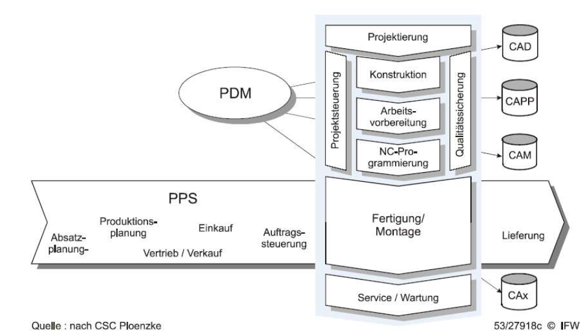

> Quelle: [Wikipedia-PPS](https://de.wikipedia.org/wiki/PPS-System)

## PMI

> **P**roduct **M**anufacturing **I**nformation

- Hinzufügen nicht-geometrischer Informationen zum CAD-Modell
- Beispiele:
  - Bemaßungen und Toleranzen
  - Anmerkungen in Textform
  - Informationen zu Oberflächenbehandlung / Finishing
  - Materialspezifikationen

## Produktentstehungsprozess (PEP)

- Bestand ist die Produktentwicklung

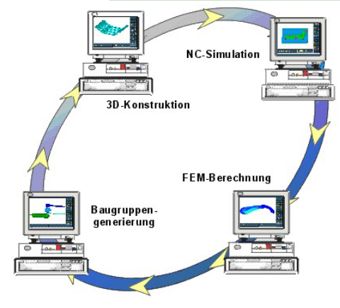

## Rapid-prototyping

**Rapid-Prototyping** bezeichnet die schnelle Herstellung eines Musters oder Modells auf Basis von CAD-Daten.

Dies geschieht häufig durch **additive manufacturing**, also z.B. 3D-Druck, wo schichtweise (additiv) das Modell hergestellt wird.

Vorteile:

- frühes Bild, wie das Produkt aussehen wird
- kostengünstige Prototypherstellung
- frühe Problemerkennung

## Rasterung (Rasterisierung oder Scanconversation)

- Problem der Umwandlung von Vektorgrafik für Rastergrafiken
- Behandlung der grundlegender Fragen des Antialiasing z.B. für Linien ebenso an dieser Stelle

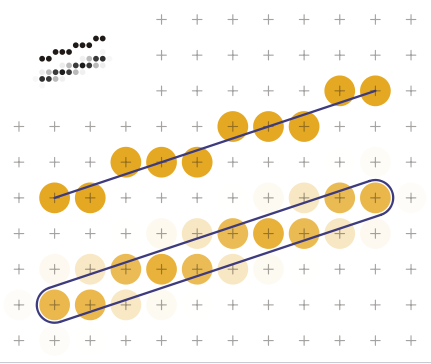

## Renderer (Bildsynthese)

- Software zur Berechnung der Bilder
- Erzeugung eines Bildes aus Rohdaten (geometrische Beschreibungen im 2D- oder 3D-Raum)
- Beispiele:
  - Fertigstellen eines Videos aus dem Schnittprogramm
  - Erstellen einer Grafik aus CAD-Modell

## Shader

- Hardware- bzw. Softwaremodule zur Berechnung im Umfeld der Computergrafik
- für Schattierungen
- siehe Aufgabe Grafikkarten und Grafikpipeline, Grafische Schnittstellen und Beleuchtungsmodelle

## subtraktive Farbmischung

- z.B. `CMY` bzw. `CMYK`
- aus vorhandenem Licht das Licht einzelner Spektralfarben herausfiltern

## Tesselierung

- Zerlegung einer exakten Geometrie in ebene Flächen (meist Dreiecke)
  - beim Datenaustausch
  - in Echtzeit siehe Grafische Schnittstellen

## Tessellation

- Einteilung der Geometrie in (ebene) Flächenelemente (Dreiecke, Vielecke)

## Texture mapping (Mapping)

- Platzieren von Grafiken auf Oberflächen
- Zuordnung von Texturkoordinaten (UVW) zu Objekt- bzw. Flächenkoordinaten (XYZ)

## Tiefenkanal (Z-Abstand oder depth channel)

> Speichert Informationen zum Abstand des Bildpunktes von der Kamera (Tiefeninformation bzw. Tiefen-Map, vgl. Alpha-Kanal)
>
> z.B. Format `OpenEXR`

## virtueller Prototyp (Digital Prototyping)

> *"Mit Digital Prototyping soll die Entwicklungszeit von neuen Produkten verkürzt, die Kosten der Entwicklung gesenkt und die Qualität der Produkte verbessert werden."*

## Virtuelles Produkt

- Vorteil: Verwaltung von Produktdaten in DB zur Unterstützung paralleler Arbeitsprozesse
- Problem: zeitgleiche Ver- und Bearbeitung von Daten kann schnell zu Inkonsistenzen im Datenbestand führen

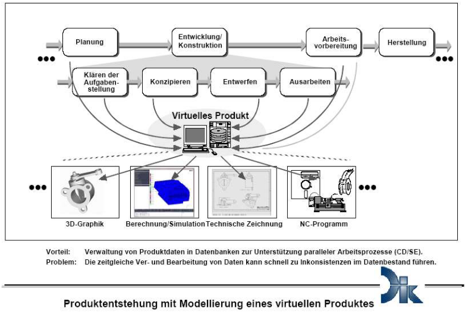

## VR, AR, MR, XR

- **V**irtual Reality: Darstellung und Wahrnehmung einer scheinbaren Wirklichkeit und ihrer Eigenschaften in Echtzeit
  - z.B. VR-Brillen
- **A**ugmented **R**eality: computergestützte Erweiterung der Realitätswahrnehmung (durch Einblendung, Überlagerung)
  - z.B. Pokemon Go
- **M**ixed **R**eality: Überführung der Realität in virtuelle Realität
  - durch Devices (Handbewegungen ins Digitale)
  - durch Kamera (realer Raum ins Digitale)
- e***X**tended **R**eality: Überbegriff für AR,VR,MR
