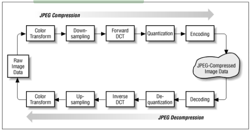

# GDV

## Additive Farbmischung

- Farben leuchten selbst
  - wenn alle leuchten $\rightarrow$ weiß
  - keine leuchten $\rightarrow$ schwarz

## Aliasing

> **Problem:** Rasterung in der Computergrafik. Ausgabe fast ausschließlich über Rastergeräte (Monitior, Drucker)

- **Treppeneffekt** wird durch **Antialiasing** entgegengewirkt
- Antialiasing wird auch in Hardware implementiert (Full-Scene Antialiasing - FSAA)

> Alternativ: **Alias-Effekt**

## Alphakanal

- definiert **Transparenz** einzelner Bildpunkte
- nicht von allen Datenformaten für Pixelbilder unterstützt

## Ambient Occlusion

- Verfahren zur Approximation realistischer Verschattung von Szene
- geringe Rechenzeit aber physikalisch nicht korrekt

> Alternativ: **Umgebungsverdeckung**

## Splines

> B-Spline, Bézierkurve, ...

- in CAD & DCC-Systemen
- Funktionen, die stückweise aus Polynomen höchsten n-ten Grades zusammengesetzt sind
- beschreiben Schriftarten in der Computergrafik

## Beleuchtungsmodell

> Unterscheidung in lokale und globale Beleuchtungsmodelle

- **lokale Modelle:** Phong, Blinn
- **globale Modelle** Raytracing, Ausbreitung von Licht einer Szene

> Bedeutend für Bildsynthese (Grafik aus Rohdaten erzeugen)

## Bildraum

- Verarbeitung von (2D-)Bildinformationen

## Boundary Representation (BREP)

- exakte Geometrie z.B. in Dateiformaten für den Datenaustausch (z.B. JT, STEP)
- Darstellungsform eines Flächen- oder Volumenmodells in der Objekte durch begrenzte Oberflächen beschrieben werden

> Alternativ: **B-REP**

## CAD

- **C**omputer-**a**ided **D**esign
- Unterstützung von konstruktiven Aufgabe mittels EDV
- Weitere Unterteilung: MCAD (Mechanik), ECAD (Elektronik)

## CAE

- **C**omputer-**a**ided **E**ngineering
- Rechnergestützte Entwicklung (CAD)

## CAM

- **C**omputer-**a**ided **M**anufacturing
- Teilaspekte der Fertigungstechnik bzw. Arbeitsvorbereitung (z.B. Erstellung von NC-Programmen)

## CG

- **C**omputer **G**raphics
- Computergestützte Bilderzeugung (und im weiteren Sinne -bearbeitung)

## Clipping

- 2D-Bereich: z.B. Ansichtsfenster
- 3D-Bereich: in Form eines Clippingvolumens
- Probleme z. B. im 3D-Umfeld (Spieglungen, Schatten, ...)

## Computer Vision

- Verarbeitung und Analyse von Bildern, um:
  - Inhalt zu verstehen
  - geometrische Informationen zu extrahieren
- z.B. Objekterkennung, Vermessung geometrischer Strukturen (3D-Scan)

## CSG

> **C**onstructive **S**olid **G**eometry

- Technik zum Modellieren von Körpern
- Grundlage: Kombination von Grundkörpern durch **boolesche Operatoren**

## DCC

> **D**igital **C**ontent **C**reation

- Erstellung von multimedialen Inhalten
- Zusammenfassung verschiedenster Technologien

## Digitale Prozesskette

## Digitaler Zwilling

- digitale Repräsentation eines Objektes aus der realen Welt in der digitalen Welt

## ERP

> **E**nterprise **R**esource **P**lanning

- betriebswirtschaftliche Softwarelösungen zur Steuerung von Geschäftsprozessen

## Farbmodell

- z.B. RGB, CMYK, HSV, ...
- definieren eine abstrakte Darstellung von Farben $\rightarrow$ Berechenbarkeit
- innerhalb der Modelle sind allen Farben eindeutige Zahlenwerte zugeordnet

## Farbprofil

## Farbraum

- Alle Farben eines Farbmodells

## Farbtiefe

## Feature Modellierung

## Freiheitsgrade

## Gammakorrektur

## Geometrische Schnittstelle

## Grafikpipeline

## Grafische Schnittstelle

## Graphisches Kernsystem (GKS)

## High Dynamic Range Image (HDRI)

## Image-based Lighting (IBL)

## indizierte Farben

## Industrie 4.0

## Integriertes Produktdatenmodell

## Internet of Things

## Kernelmodellierer

- Modellierkern (geometric modeling kernel)
- Bsp.: ACIS, Parasolid
- 3D solid modeling software component für CAD

## Komprimierung (Bildkompression)

Hier für die verlustfreie oder verlustbehaftete Komprimierung in Dateiformaten (speziell für Pixelgrafiken). z. B. RLE, JPEG oder Wavlet.

## Koordinatentransformationen

- Koordinaten eines Punktes in einem Koordinatensystem dessen Koordinaten in einem anderen Koordinatensystem berechnet

wir behandeln:
- Translation
- Rotation
- Skalierung
- Spieglung
- Scherung

## Leuchtdichte (Luminance)

"Die Leuchtdichte beschreibt die Helligkeit von ausgedehnten, flächenhaften Lichtquellen; für die Beschreibung der Helligkeit von punktförmigen Lichtquellen ist die Lichtstärke besser geeignet."

## Level of Detail (LOD)

- auch Verwendung in JT-Format für Datenaustausch (siehe Tesselierung)
- verschiedene Detailstufen bei der Darstellung virtueller Welten

## Lichtquellen (Lichttypen)

- verschiedene Lichtausbreitungsberechnungen (Energieerhaltung)
- siehe Image Based Lighting

## Mach-Band-Effekt (Machsche Streifen oder Machsche Bänder)

- Verstärkung des Kontrastes zwischen unterschiedlich hellen Flächen
- Kontrastphänomen, dass Farben aufgrund der Nachbarfarben heller oder dunkler wirken

## Material Beschreibung

- Parameter zur Beschreibung der optischen Eigenschaften eines Werkstoffs
  - abhängig vom eingesetzten Berechnungsverfahren (Renderer)
  - Anforderungen an den Datenaustasuch (siehe Geometrische Schnisstellen)
  - neue Anforderungen für Echtzeitvisualisierungen
  - einfache Modelle z.B. für Phon Beleuchtungsmodell und Phong Shading
  - Wechsel zu physikbasierten Materialbeschreibungen z.B. MDL

## Mechatronik

- Verbindung Mechanik (MCAD), Elektronik (ECAD), Software

## Metaball-System (blob oder BlobMesh)

Spezielle Modellierungsmethode auf Basis von Grundelementen Kugeln mit Eigenschaften welche mit der Oberflächenspannung von Wassertropfen verglichen werden können

## Metadaten (Attribute, Eigenschaften)

- Zusätzliche Informationen z.B. in Dateien (3D-Modelle, Pixelbilder)
- Beispiele Fotos: EXIF
- siehe geometrische Schnittstellen (z.B. JT, STEP)
- Ablage auch in Datenbanksystemen z.B. für PDM, PLM und Assetmanagement

## Objektraum

- Definition von 2D- und/oder 3D-Geometrie

## Phong Beleuchtungsmodell

- einfaches Modell zur Berechnung der Schattierung von Oberflächen
- diffuse R., spekuläre R., ambiente R.
- für Darstellung von glatten, plastikähnlichen Oberflächen geeignet
- keine physikalische Grundlage
- trotzdem Dank seiner Einfachheit hohe Beliebtheit

## PLM (Product-Lifecycle-Management)

## Produktentstehungsprozess (PEP)

- Bestand ist die Produktentwicklung

## Rasterung (Rasterisierung oder Scanconversation)

- Problem der Umwandlung von Vektorgrafik für Rastergrafiken
- Behandlung der grundlegender Fragen des Antialiasing z.B. für Linien ebenso an dieser Stelle

## Renderer (Bildsynthese)

- Software zur Berechnung der Bilder
- Erzeugung eines Bildes aus Rohdaten (geometrische Beschreibungen im 2D- oder 3D-Raum)

## Shader

- Hardware- bzw. Softwaremodule zur Berechnung im Umfeld der Computergrafik
- für Schattierungen
- siehe Aufgabe Grafikkarten und Grafikpipeline, Grafische Schnittstellen und Beleuchtungsmodelle

## subtraktive Farbmischung

- z.B. `CMY` bzw. `CMYK`
- aus vorhandenem Licht das Licht einzelner Spektralfarben herausfiltern

## Tesselierung

- Zerlegung einer exakten Geometrie in ebene Flächen (meist Dreiecke)
  - beim Datenaustausch
  - in Echtzeit siehe Grafische Schnittstellen

## Tessellation

- Einteilung der Geometrie in (ebene) Flächenelemente (Dreiecke, Vielecke)

## Texture mapping (Mapping)

- platzieren von Grafiken auf Oberflächen
- Zuordnung von Texturkoordinaten (UVW) zu Objekt- bzw. Flächenkoordinaten (XYZ)

## Tiefenkanal (Z-Abstand oder depth channel)

Speichert, vergleichbar mit dem Alpha-Kanal, Informationen zum Abstand des Bildpunktes von der Kamera (Tiefeninformation bzw. Tiefen-Map)
z.B. Format OpenEXR

## virtueller Prototyp (Digital Prototyping)

"Mit Digital Prototyping soll die Entwicklungszeit von neuen Produkten verkürzt, die Kosten der Entwicklung gesenkt und die Qualität der Produkte verbessert werden."

## Virtuelles Produkt

