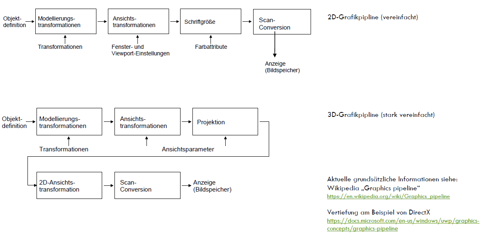

# Lernkontrollfragen: Grafische Datenverarbeitung

## Wofür steht CAD und wofür CAE?

computer-aided Design (CAD)
computer-aided Engineering (CAE)

### Wofür steht computer-aided Design (CAD)?

- computergestützte Erstellung von Modellen (2D, 3D)
- Unterstützung von konstruktiven Aufgaben mittels EDV

### Wofür steht computer-aided Engineering?

- alle Varianten der Rechner-Unterstützung von Arbeitsprozessen in der Technik (Wikipedia)
- Analyse der entworfenen Visualisierung

## Auf welchen Prozess des Produktlebenszyklusses konzentrieren wir uns im Kurs?

- Produktentstehungsprozess
  - Produktentwicklung
    - Produktentwurf

## virtuelle Prototypen, rapid prototyping, additive manufacturing

- schnelle Entwicklung von Protoypen im Objektraum
- Simulation des Prototypen mit allen Eigenschaften des realen Produkts
- Rapid Prototyping ist die schnelle Herstellung eines Musters oder Modells eines Bauteils
- 3D-Druck/additive Fertigung beschreibt Fertigungsverfahren, bei welchen Material Schicht für Schicht aufgetragen wird mit dem Ziel dreidimensionale Gegenstände zu realisieren

## Was versteht man unter "Mechatronik"?

Verbindung Mechanik (MCAD) mit Elektronik (ECAD) und Software

## Nennen Sie die Phasen des Produktlebenszyklus

- Produkt**entstehung**
- Produkt**vertrieb**
- Produkt**nutzung**
- Produkt**recycling** und -**entsorgung**

## Wofür steht PDM/PLM?

- Product-Lifecycle-Management(PLM)
- Produktdatenmanagement (PDM)
- PDM $\subset$ PLM

## Was ist das Ziel eines PDM- bzw. PLM-Systems?

>Unternehmen erhoffen sich vom PLM eine verbesserte Kontrolle über die diversen Prozesse, die in jedem Teil eines Lebenszyklus erforderlich sind, und damit auch transparente Aufwände und Erträge. ([Wikipedia](https://de.wikipedia.org/wiki/Product-Lifecycle-Management))

- Verkürzung des Zyklus in bestimmten Teil-Bereichen
- Optimierung der Effizienz der Herstellung
- Verminderung von Kosten
- Wegfall redundanter Datenerfassungen im Unternehmen

[Source](https://www.gain.de/plm-system-product-lifecycle-management/)
[further reading](https://4-plm.de/plm-consulting/)

## Was ist ein "Virtuelles Produkt"?

Mittelpunkt des Produktentstehungsprozesses

- die rechnerinterne Repräsentation der Summe der Eigenschaften eines Produkts,
- zur ganzheitlichen Analyse und Simulation des Produktverhaltens erforderlich
  - insbesondere die Abbildung des Produktverhaltens in den einzelnen Phasen des Produktzyklus

## Erklären Sie den sogenannten "digitalen Zwilling"!

- digitale Abbildung bzw. Repräsentanz eines realen Objektes oder Prozesses
  - inklusive Geometrie-, Kinematik- und Logikdaten
- Kommunikation zwischen realen und virtuellem Objekt

## Wie unterscheiden Sie Objektraum und Bildraum?

Objektraum: Definition von 2D- und/oder 3D-Geometrie (Objektdaten im CAD)

Bildraum: Verarbeitung von (2D-)Bildinformationen (Pixel)

(Glossar)

## Was verstehen Sie unter "Computervision"?

- Analyse und Objekterkennung in Bildern
- Umwandlung in Objektdaten (Bildraum -> Objektraum)
  - z.B. OCR
  - autonomes Fahrzeug erkennt Objekte um sich herum anhand von Kameras

## Was stellen Sie sich unter Objektraum vor?

- interne/geometrische Repräsentation von Objekten
  - CAD-Daten, z.B. .obj

> vgl: Objektraum->Bildraum : Computergrafik (3DS Max, Inventor Anzeigen des Modells)

## Wofür stehen PPS und PDM?

> PPS-System (Produktionsplanungs- und Steuerungssystem)

- ist ein Computerprogramm oder ein System aus Computerprogrammen
- den Anwender bei der Produktionsplanung und -steuerung unterstützt
- und die damit verbundene Datenverwaltung übernimmt.

(Folie 26, Skript A anschauen)

PPS: BWL-Sicht

PDM (Produktdatenmanagement): Technische Sicht

## Was kennzeichnet ein integriertes Produktdatenmodell?

- Produktdefinition
- Produktrepräsentation
- Produktpräsentation (Darstellung der Repräsentation)

- Applikationen (CAD,CAE,CAM,CAx) an PDM-System angeschlossen
- Daten liegen in PDM, System, gemeinsamer Zugriff über Benutzeroberfläche
- vgl. 3-Schichten-Architektur

(Folie 21f., Skript A)

## Nennen Sie Beispiele für anwendungsbezogene und anwendungsübergreifende Funktionen eines PDM-Systems.

### anwendungsbezogene Funktionen eines PDM-Systems

- CAD-Datenverwaltung
- Arbeitsplanverwaltung
- Projektplanungsdaten
- NC-Code-Verwaltung
- Werkzeug und Betriebsmittelverwaltung
- Methodenmanagement

### anwendungsübergreifende Funktionen eines PDM-Systems

- Benutzerverwaltung
- Datenschutz
- Datensicherheit
- Archivierung
- Änderungs-und Freigabemanagement

## Wofür steht der Begriff "vault" im Zusammenhang mit PDM-/PLM-Systemen?

- data vault: Zusammenfassung aller Engineering-Daten (Produkt- und Metadaten)
- inklusive Zugriffssteuerung (Datenkonsistenz gewährleisten)

## Erklären Sie die Unterscheidung in Produktdaten und Metadaten im Zusammenhang mit PDM-PLM-Systemen.

> Produktdaten sind die "tatsächlichen" Daten des Produkts, notwendige zur Herstellung des Produkts.
> z.B. 3D-CAD-Modell

Metadaten enthalten die

- beschreibenden und
- klassifizierenden Attribute sowie die zur Verwaltung notwendigen Informationen wie
  - Ersteller
  - Erstelldatum
  - Dokumentstatus
  - Versionierung

> Metadaten beziehen sich auf den Entwicklungsprozess

## Wofür steht die Anforderung der Rückverfolgbarkeit bei PDM-Systemen?

Wann wurde was von wem auf welche Weise hergestellt oder modifiziert? (vgl. Git blame)

Außerdem: Gründe für Änderungen, Lieferant

## Nennen Sie Beispiele für Applikationen im Zusammenhang mit CAE/CAD.

- AutoCAD
- Autodesk Inventor
- Solid Works
- Siemens NX
- CATIA

## Nennen Sie Beispiele für CAD-Kernel

- Parasolid (Siemens)
- Granite One (PTC)
- ACIS (Spatial / Dassault Systemes)

## Aufbau von CAD-Systemen

- Grafikkernel
- Programmierschnittstellen (API)
- Benutzeroberfläche (UI)
  - Geometrie-Solver
- grafische Schnittstellen
  - DirectX, OpenGL, ...
- geometrische Schnittstellen
  - Dateiformate
    - STEP, JT, STL, ...

## Besonderheiten CAD-Rechner

- High-Performance-PCs erforderlich
  - High-End GPU (z.B. NVidia Quattro, AMD Radeon Pro)
  - \>32, besser 64 GB RAM
  - Multicore CPU mit hoher Taktrate

### besondere E/A-Komponenten beim CAD-Rechner

- Spacemouse zur erleichterten Bedienung
- 3D-Drucker
- VR/AR Systeme (Microsoft HoloLens)

## Grafikstandards- bzw. Schnittstellen

- GKS (Grafisches Kernsystem)
- OpenGL
- DirectX (Graphics)
- Vulkan

## Welche Betriebssysteme stehen für CAD-Systeme bevorzugt zur Verfügung?

Windows, macOS (Linux als Ausnahme)

## Nennen Sie bekannte bzw. große Hersteller für CAD-Systeme.

- Autodesk
- Siemens
- Dassault Systemés
- PTC

## Durch welche Aktivitäten ist der Markt der Softwareanbieter für die digitale Produktentwicklung gekennzeichnet?

- Abomodelle
- Rolling Release (kontinuierliche, kleinere Updates, meist in Verbindung mit besagten Abomodellen)

## Beschreiben Sie die Herangehensweise für die Geometriebeschreibung mittels CSG.

- CSG $\rightarrow$ Constructive Solid Geometry
- Platzierung von graphischen Primitiven, sodass sie eine Schnittmenge ergeben \rightarrow\rightarrow Verknüpfung mit booleschen Operatoren

## Was sind Feature im Zusammenhang mit CAD-Modellen?

- Bsp.: Bohrungen, Fasen, Flansche
- Formelemente
- manipulieren Komponenten
- sind Kindelemente von Komponenten

## Welche Booleschen Operatoren kennen Sie im Zusammenhang mit CSG?

- Vereinigung, Differenzmenge, Schnittmenge

## Beschreiben Sie die geometrische Nutzung boolescher Operationen in CAD und CG.

- Kombination graphischer Primitive zur Bildung komplexer Geometrien

## Nennen Sie 2D-Grundelemente

- Kreis
- Rechteck
- Dreieck

## Nennen Sie 3D-Grundelemente

- Quader, Zylinder
- Kugel, Kreisring

## Volumenmodelle

- Erweiterung des Flächenmodells
- Beschreibung der geometrischen Eigenschaften eines 3D-Grundelements

## Was sind Formelemente?

- Manipulation von geometrischen 3D-Grundelementen
  - durch Boolsche Operatoren
  - durch Features

## Aus welchen geometrischen Elementen ist eine komplexe Geometrie aufgebaut?

- Einzelteile bestehen aus Volumen
- Volumen werden von Flächen eingeschlossen
- Flächen bestehen aus Kanten
- Kanten bestehen aus Punkten

## Vorgehensweise Modellierung mit Inventor

- Erstellung von 2D-Skizzen (Constraints, Bemaßung)
- Erstellung von 3D-Modelle auf Basis der 2D-Skizzen (Extrusion)
- Bearbeiten der 3D-Elemente mit Hilfe von Features und Boolschen Operationen
- ggf. weitere Skizzen auf 3D-Element erstellen

## Woran erkennt man schnell die Komplexität der Darstellung einer Geometrie?

- Vertices anzeigen lassen (Ecken eines Polygons)

## Was versteht man unter Tesselierung/Tesselation und wann wird sie angewendet?

- Zerlegung einer exakten Geometrie in ebene Flächen (meist Dreiecke)
- beim Datenaustausch (JT-Format, DCC-Formate)

## was versteht man unter Level of Detail?

- Detailgrad der Darstellung eines 3D-Modells
- vor allem bei Export eines 3D-Modells/Umwandlung in Neutralformat
- siehe JT Streaming

## Worum handelt es sich bei geometrischen Randbedingungen?

- Constraints
- legen Verhältnis zwischen geom. Grundelementen fest
- Bsp.: Orthogonalität, Parallelität, Winkel

## Wie werden Parameter im Inventor verwendet?

<!--häufig!-->

- Definition von Form und Größe von Features
- auch im Parameter-Editor
- Positionierung von Komponenten
- Bestimmung von Komponenten $\rightarrow$ keine Freiheitsgrade

## Was repräsentiert der Modellbaum (Historiengraph) im Inventor?

- Projekthierarchie, Vererbung, Komponentenhistorie

## Was versteht man unter "Parametric Design"?

<!--Quatsch-->

- Parameter können editiert werden, Komponente passt sich entsprechend an
- Inventor: unter Verwendung des Parameter-Editors
  - Nutzung von Variablen zur Bemaßung

## Was sind Skizziertechniken (CAD)?

- Anfertigen einer 2D-Skizze als Basis für 3D-Modell
- mit Unterstützung des Solvers

## Was sind Bauteile?

- einzeln und zusammenhängendes 3D-Modell
- besteht aus (Grund)elementen und Features

## Was sind Baugruppen?

- bestehen aus Bauteilen (n-fache Verwendung eines Bauteils möglich)

## Was ist das Ziel geometrischer Grundelemente im 2D- und 3D-Bereich?

- bilden Basis für Modellierung
- ermöglichen Datenaustausch durch Annäherung von komplexen Geometrien (z.B.: B-Spline $\rightarrow$ Kreis)
- "vom Groben zum Feinen"

## Was ist eine Bezierkurve?

- Spline, Freiformkurve
- geht durch Punkte oder mithilfe von Polen

## Was sind NURBS?

- Non-Uniform Rational B-Splines and Surfaces
- exakt beschriebene Freiformflächen
- alle CAD-Systeme sind NURBS-Modellierer

## Wie wird Truetype-Font geometrisch beschrieben?

- bestehen ausschließlich aus B-Splines 2. Grades

## Worum handelt es sich bei sog. "metaballs"?

- s. Wassertropfenform
- Modellierungsform auf Basis von Kugeln als Grundelement
  - mit Eigenschaften wie Oerflächenspannung

## Was versteht man unter "Subdivision Surface Modeling"?

- Flächenverteilungsmodellierung

## Welche Zellen im menschlichen Auge sind für die Farbwahrnehmung verantwortlich?

- **Zäpfchen** sind im menschlichen Auge für die **Farbwahrnehmung** verantwortlich
- **Stäbchen** sind für die Wahrnehmung von **Grautönen** (Hell-Dunkel-Sehen)

## Mit welchen biologischen Argumenten wird die Drei-Farben-Theorie begründet.

- es gibt mindestens drei unterschiedliche Rezeptoren, die auf unterschiedliche Wellenbereiche reagieren
- Erregungszustand des Auges über die drei Rezeptoren abbilden können
- auch andere Ansätze schon bekannt: z.B. Farbe Gelb hinzufügen (da mit der 3 Farben-Theorie allein nicht alle sichtbaren Farben generiert werden können)

## Worum handelt es sich im physikalischen Sinne, wenn wir von Licht sprechen?

- elektromagnetische Energie ("Welle" wäre auch richtig)

## Erklären Sie die Begriffe "Farbton" und "Sättigung" genauer.

- Farbton = dominante Wellenlänge
- Sättigung = Reinheit bzw. Intensität einer Farbe

## Welche (Farb-)Werte können Sie mit Hilfe des HLS/HSL-Modells verändern/definieren?

## Was beschreibt das CIE-Farbwertdiagramm?

- alle Farben, die der Mensch sehen kann

## Woher kommen die Unterschiede im Farbraum z.B. für den Zeitungsdruck & typische Monitore?

- unterschiedliche Technologien, wie man zur Farbe kommt
- additive Farbmischung für Monitore
- subtraktive Farbmischung (man sieht nur die reflektierten Farbanteile) $\rightarrow$ für Zeitungsdruck

## Erklären Sie additive und subtraktive Farbmischung

- additiv: Farben leuchten selbst, wenn alle leuchten erhalten wir weiß, wenn keine leuchten schwarz
- subtraktiv: Farben sind auf reflektiertes Licht hingewiesen, verwenden daher Komplementärfarben von RGB $\rightarrow$ CMY

## Welche Typen von Lichtquellen werden beispielhaft unterschieden? Warum werden unterschiedliche Typen definiert?

- Punktlichtquelle, Flächenstrahler, ...
- Abstrahlcharakteristik, unterschiedliche Ausbreitungsmodelle mit unterschiedlichen Berechnungsmodellen

## Welche Möglichkeiten haben Sie beispielhaft um eine Szene mittels Licht realistischer zu gestalten?

- Reflektion
- Schattenberechnung, Schattenwurf, unterschiedliche Modelle (z.B. Raytracing), Schattenmaps mit Parametern

## Wie erfolgt die Umrechnung vom CMY- in das RGB-Farbmodell?

- Farbwerte werden invertiert

$$
R = 255 \cdot (1-C) \\
G = 255 \cdot (1-M) \\
B = 255 \cdot (1-Y)
$$

## Umrechnung CMY in RGB normalerweise nicht verlustfrei. Warum?

- liegt am Farbprofil
- Farbmanagement deaktivieren um Farbprofile nicht zu berücksichtigen
- dementsprechend dann verlustfrei

## Erklären Sie die Unterschiede zwischen Farbmodell, Farbraum und Farbprofil. (und Verbindungen der einzelnen Sachen)

## Aus welchen Reflexionsanteilen setzt sich das Beleuchtungsmodell nach Phong zusammen? Wie werden die Faktoren für reale Materialien ermittelt?

- diffuse Reflektion
- spekuläre Reflektion
- ambiente Reflektion

**TODO: Wie ordnet man die Dinge hier zu?**

- ideal spiegelnd
- gerichtet diffus
- ideal diffus

## Wie werden die Berechnungsverfahren wie Phong, Metal, Blinn usw. aus technischer Sicht bezeichnet?

## Welche Bedeutung haben die grafischen Schnittstellen OpenGL, DirectX/3D?

## Welche Bestandteile des JT-Datenformates können Sie benennen?

## Worum handelt es sich bei der Abkürzung "BREP"?

## Probleme geometrische Schnittstellen/Direktschnittstellen/Neutralformate

## 2D-, 3D-Grafikpipeline

## Bildauflösung, Bildschirmgrößen, Seitenverhältnisse

- Begriff mehrdeutig:
  - physikalisch: Pixel pro LE
  - umgangssprachlich: Höhe und Breite in Pixeln
- beliebte Formate [in der Wikipedia](https://de.wikipedia.org/wiki/Bildaufl%C3%B6sung#/media/Datei:Vector_Video_Standards.svg)

## Dithering, Antialiasing und Aliasing

- Dithering/Fehlerdiffusion:
  - Technik in der Computergrafik um bei Bildern mit verringerter Farbtiefe die Illusion einer größeren Farbtiefe zu erzeugen
    - d.h. mit Mustern größere Farbtiefe antäuschen
- Aliasing/Kantenentstehung:
  - unerwünschte Effekte, welche bei der Erzeugung von Computergrafiken aufgrund der begrenzten Pixelanzahl entstehen
    - Treppeneffekt
    - vgl. Kreis durch Pixel dargestellt
- Antialiasing/Kantenglättung:
  - Verminderung von unerwünschten Effekten die durch das begrenzte Pixelraster entstehen würden
  - Bildinhalte werden nicht mehr nur an Pixeln sondern auch an anderen Positionen ausgewertet

## Farbe, Farbton, Sättigung

- Farbe: vermittelter Sinneseindruck (durch Zäpfchen)
- Farbton: durch dominante Wellenlänge definiert
- Sättigung: Intensität und Reinheit eines Farbtons

## Licht-, Schattenberechnung, Leuchtdichte

- Lichtberechnung: Lichtstrahlen von Leuchtquelle aus
- Schattenberechnung: TODO
- Leuchtdichte: Lichtstärke pro Fläche
- Sichtbares Licht: Wellenlängen zwischen 400nm und 780nm

## Lichtquellen, Lichtausbreitung

- die Sonne<!--praise the sun!-->, Punktlicht, Spotlicht, Netzlicht
- Ausbreitung abhängig vom Lichtquelle

## Farbraum, Farbprofil, CIE-Diagramm

- CIE-Diagramm: Farbraum, der vom menschl. Auge wahrgenommen werden kann
- TODO

## TODO

Farbraum, Farbprofil, CIE-Diagramm, Weißpunkt

- Farbmodelle RGB, CMYK, HSV, Umrechnung, Darstellungen, additive und subtraktive
Farbmischung
- Farbtiefe, Alpha-Kanal und Transparenz, Tiefeninformationen (Z-Abstand)

## Dateiformate, Komprimierung (DCC)

- verlustfreie und verlustbehaftete Komprimierung
  - JPEG-Artefakte, ...
- `.max`, `JT`, `FBX`, `OBJ`

## Dateiformate, Komprimierung (CAx)

- verlustfreie und verlustbehaftete Komprimierung
  - Verluste u.a.: Tesselierung, keine Historie, komplexe Geometrie durch Primitive abgebildet
- Neutralformate: `JT`, `STEP`, `MTL`
- Dateiformate: `CAT`, `CATpart`, Bauteil: `IPT`, Baugruppe: `IAM`

## Polygonzug

- Kantenzug durch mehrere Punkte $\rightarrow$ offener oder geschlossener Polygonzug

## Polygon

- geschlossener Polygonzug $\rightarrow$ schließt Fläche ein

## Spline, B-Spline

- Spline: Polynom n-ten Grades
  - B-Spline: Vereinfachung von Spline $\rightarrow$ reduziert Komplexität des Spline und somit Berechnungszeit durch Approximation

## Interpolation

- Splines und B-Splines können durch Interpolation beschrieben werden
  - > finde Funktion, die durch die Punkte geht