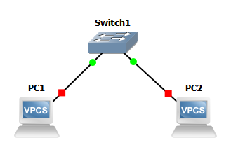
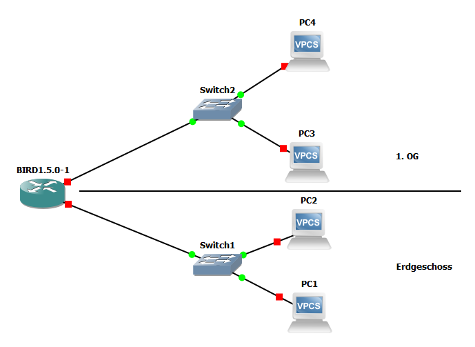
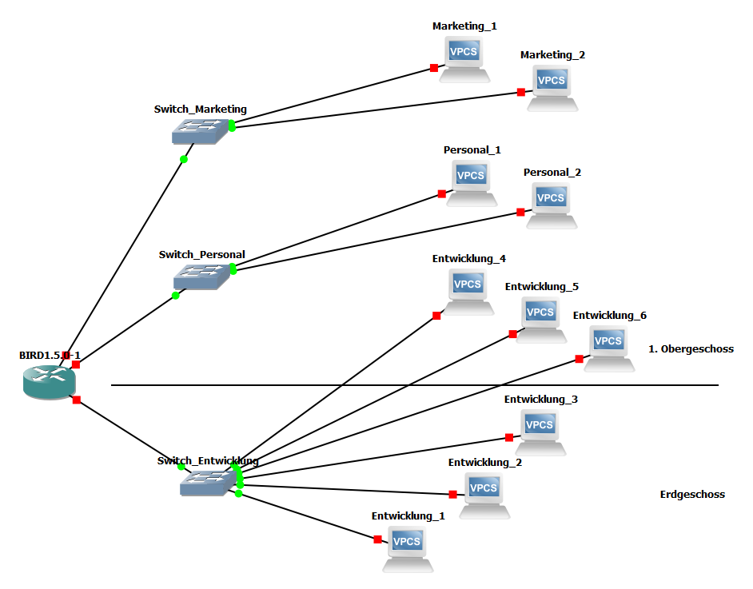

<!----------
title: "Rechnernetzadministration/Verteilte Systeme"
date: "Semester 5"
keywords: [Rechnernetzadministration, Verteilte Systeme, NET, DHGE, Semester 5]
---------->

Rechnernetzadministration/Verteilte Systeme
===========================================

<!-- md2apkg ignore-card -->

<!-- START doctoc generated TOC please keep comment here to allow auto update -->
<!-- DON'T EDIT THIS SECTION, INSTEAD RE-RUN doctoc TO UPDATE -->
**Inhaltsverzeichnis**

- [Rechnernetzadministration/Verteilte Systeme](#rechnernetzadministrationverteilte-systeme)
- [Literaturempfehlung](#literaturempfehlung)
- [Einleitung](#einleitung)
  - [Designziele](#designziele)
  - [Wiederholung Grundlagen](#wiederholung-grundlagen)
    - [Netzwerk](#netzwerk)
    - [Klassifizierung von Datennetzen](#klassifizierung-von-datennetzen)
      - [Räumliche Ausdehnung](#räumliche-ausdehnung)
      - [Größe/Anzahl der Teilnehmer](#größeanzahl-der-teilnehmer)
      - [Hardware-Sicht](#hardware-sicht)
      - [Logische Sicht](#logische-sicht)
        - [ISO/OSI und TCP/IP](#isoosi-und-tcpip)
      - [Topologie-/Struktursicht](#topologie-struktursicht)
      - [Logische Struktur](#logische-struktur)
      - [Einschub: Frames/Sicherungsschicht](#einschub-framessicherungsschicht)
        - [Grober Aufbau eines Frames](#grober-aufbau-eines-frames)
        - [Paketkollision](#paketkollision)
      - [Einschub: Geräte](#einschub-geräte)
    - [Topologien auf der logischen Ebene](#topologien-auf-der-logischen-ebene)
      - [flache Topologie](#flache-topologie)
      - [standortbasiert](#standortbasiert)
      - [funktionsgruppenbasierte Topologie](#funktionsgruppenbasierte-topologie)
      - [Overlay-Netzwerke](#overlay-netzwerke)
      - [VLAN](#vlan)
<<<<<<< HEAD
        - [Einschub: Frames/Sicherungsschicht](#einschub-framessicherungsschicht)
          - [Grober Aufbau eines Frames](#grober-aufbau-eines-frames)
        - [Einschub: Geräte](#einschub-ger%C3%A4te)
=======
    - [Einschub: Frames/Sicherungsschicht](#einschub-framessicherungsschicht)
    - [Paketkollision](#paketkollision)
    - [Einschub: Geräte](#einschub-ger%C3%A4te)
    - [Topologien auf der logischen Ebene](#topologien-auf-der-logischen-ebene)
      - [flache Topologie](#flache-topologie)
      - [standortbasiert](#standortbasiert)
      - [funktionsgruppenbasierte Topologie](#funktionsgruppenbasierte-topologie)
      - [Overlay-Netzwerke](#overlay-netzwerke)
      - [VLAN](#vlan)
>>>>>>> origin/oko-res

<!-- END doctoc generated TOC please keep comment here to allow auto update -->

<!--newpage-->

# Literaturempfehlung

<!-- md2apkg ignore-card -->

- Saida Helali: Systems and Network Infrastructure Integration
- J. Scott Marcus: Designing Wide Area Networks and Internetworks
- Jeff Bollinger: Crafting the InfoSec Playbook
- Tanenbaum: Computer Networks
- Douglas R. Mauro: Essential SNMP
- Thomas A. Limoncelli: The Practice of System and Network Administration

# Einleitung

## Designziele

- **Funktional:** Erfüllung der Anforderungen im Lastenheft $\rightarrow$ Benutzer können ihre Arbeit unter optimalen Bedingungen erfüllen
- **Ausbaufähig:** Wachstum muss möglich sein
- **Wartbarkeit:** von der Entwurfsphase an muss einfache Wartung/Betrieb eingeplant werden $\rightarrow$ Doku
- **Adaptivität:** Anpassung an neue Technologien

## Wiederholung Grundlagen

### Netzwerk

- besteht aus Hard- und Software
- durch kabelgebundene und/oder drahtlose Übertragungssysteme verbunden
- zur Übertragung/Verarbeitung von Informationen
- digitale Datennetze (es sollen keine Rundfunknetze und Telefonnetze behandelt werden) \rightarrow\rightarrow NGN (Next Generation Networking)

### Klassifizierung von Datennetzen

- Topologien/Strukturen
- Größe/Leistungsfähigkeit (Anzahl Clients)
- Übertragungmedium
- Anwendungsbereich: Protokollebene (Heterogen/Homogen)
- Hard-/Software
- Räumliche Ausdehnung (LAN, WAN, etc.)
- Betriebsmodus (Client-Server, Peer-to-Peer)

#### Räumliche Ausdehnung

- **PAN:** Personal Area Network, Reichweite *1m-10m* (bspw. Bluetooth)
- **LAN:** Local Area Network, Reichweite *10m-1km*
- **MAN:** Metropolitan Area Network, Reichweite *1-100km*
- **WAN:** Wide Area Network
- **GAN:** Global Area Network

#### Größe/Anzahl der Teilnehmer

- klein: ~200 Teilnehmer
- mittel: ~1000..2000 Teilnehmer
- groß: >2000 Teilnehmer

#### Hardware-Sicht

- Endgeräte (PC, Handy, Telefon, Server, Drucker, IoT, Management-Stationen)
- Kopplungsgeräte (Switch, Firewall, Repeater, Router, Bridge, Hub, Modem, Access-Point)
- Übertragungsmedien (Kabel, Funk)

#### Logische Sicht

##### ISO/OSI und TCP/IP

| Schicht                | Funktion                                                     | Protokolle | TCP/IP                          |
| ---------------------- | ------------------------------------------------------------ | ---------- | ------------------------------- |
| Anwendungsschicht      | Kommunikation zw. Anwendungen                                | NFS, DNS,  | Anwendungungsschicht            |
| Darstellungsschicht    | Transformation zw. Datenformaten, Verschlüsselung            | DHCP, HTTP | Anwendungungsschicht            |
| Sitzungsschicht        | Dialogsteuerung, Synchronisation                             | FTP, ...   | Anwendungungsschicht            |
| Transportschicht       | Ende-zu-Ende-Kommunikation zw. Prozessen                     | TCP, UDP   | Transportschicht                |
| Vermittlungsschicht    | Wegewahl Sender -> Empfänger, Kopplung heterogener Teilnetze | IP         | Internetschicht                 |
| Sicherungsschicht      | Behandlung von Übertragungsfehlern                           | Ethernet   | Netzzugangsschicht (Link Layer) |
| Bitübertragungsschicht | physikalische Ebene -> Übertragung von Signalen              |            | Netzzugangsschicht (Link Layer) |

#### Topologie-/Struktursicht

- ~~**Bus**~~ (in LV nicht betrachtet)
- **Stern** (Switch verbunden zu Host 1..n; Routerverbunden zu  Switch 1..n)
  - *nicht nur in Geräten denken, sondern allgemein in Strukturen*
  - Vorteil: schöne Struktur (leicht verständlich, wartbar), kostengünstig
  - Problem: Zentrale (Router, Switch) ist SPOF
- Lösung Redundanz: Stern aufbrechen $\rightarrow$ mehrere kleinere Sterne, redundant verbunden
  - $\rightarrow$ SPOF nicht mehr katastrophal, weniger Langstreckenverkehr
- **Ring:** weitere Redundanzen durch ringförmige Verbindungen der Zentralen (früher bereits leitungsvermittelt: SoNET/SDH $\rightarrow$ Telekom)
  - jede Einheit ist mit zwei anderen verbunden
    - Vorteil: einzelne Verbindung kann ausfallen, Kommunikation weiterhin möglich
    - Nachteil: hohe Kosten, schwerer wartbar (Strukturänderungen)
- **Mesh:** Verknüpfung von Ringen und Sternen (Teilvermascht)

#### Logische Struktur

- logische Struktur kann nicht in Übereinstimmung mit der physischen Struktur entworfen werden
- wird beeinflusst von Unternehmensstruktur, Zugang zu Diensten, Verzeichnisdienst
- z.B. flaches L2-Netz: eine Broadcast-Domäne, kein Router
  - Overlay: logische Struktur über physikalischen Netz $\rightarrow$ **VLAN** (IEEE 802.1q)

#### Einschub: Frames/Sicherungsschicht

- Bereitstellung einer wohldefinierten Schnittstelle zur Vermittlungsschicht
- Umgang mit Übertragungsfehlern
- Kommunikation zwischen benachbarten Hosts
- Regulierung des Datenflusses (Flow-Control)

$\rightarrow$ zur Erfüllung dieser Aufgaben: **Bildung von Frames/Rahmen**

##### Grober Aufbau eines Frames

```text
┌────────┬─────────┬─────────┐
│ Header │ Payload │ Trailer │
└────────┴─────────┴─────────┘
```

- Header: Verwaltungsinformationen (z.B. Infos zu Sender/Empfänger)
- Payload: Daten der höheren Schicht
- Trailer: Prüfsummen
- Frames sind je nach Implementierung unterschiedlich

##### Paketkollision

- zwei Teilnehmer senden zur gleichen Zeit Frames über ein geteiltes Medium (bspw. Bus oder Funk (bei gleicher Frequenz))
- Verhinderung mithilfe von CSMA/CD (Carrier Sense Multiple Access/Collision Detection) oder anderen Multiplex-Verfahren
- Collision-Domain $\rightarrow$ Bereich, in dem Kollisionen auftreten können
  - solche Domains sollten klein sein
  - keine Busse bauen
- Switches sollten duplex sein (heute eigentlich immer der Fall)

- Simplex (A $\rightarrow$ B; nur in eine Richtung)
- Halbduplex (A $\leftrightarrow$ B; Zwei-Wege-Kommunikation, aber nicht gleichzeitig)
- Vollduplex (A $\leftrightarrow$ B; gleichzeitige Zwei-Wege-Kommunikation)

#### Einschub: Geräte

| Layer               | Gerät                                            |
| ------------------- | ------------------------------------------------ |
| Anwendungschicht    | Application-Gateway                              |
| Transportschicht    | Transport-Gateway                                |
| Vermittlungsschicht | L3-Switch, Router                                |
| Sicherungsschicht   | Switch                                           |
| Bitübertragung      | Repeater, Kopplungselemente (Hub), (Kabel, Funk) |

- **Firewall:**
  - traditionell auf L3, bei Deep-Packet-Inspection etc. heute jedoch auch auf anderen Ebenen
  - besteht aus: Router + Application Layer Gateway + Router
- **Repeater:** analoges Gerät (analog = Zeit- und Wertkontinuierlich)
  - arbeitet mit Signalen auf Kabeln bzw. Funkstrecke
  - empfängt, bereinigt, verstärkt und sendet Signale
  - i.d.R. begrenzte Anzahl durch Latenz
- **Hub:** elektrische Verbindung mehrerer Leitungen <!-- dicker Lötklecks :D -->
  - angeschlossene Geräte sind Mitglieder der gleichen Kollision-Domäne
  - Anbindung aller Teilnehmer mit der gleichen Geschwindigkeit erforderlich
- **Bridge:** verbindet zwei/mehrere LANs (z.B. WLAN mit kabelgebundenem LAN $\rightarrow$ Access-Point)
  - Trennung der Kollisionsdomänen
  - Frames werden nur an Port gesendet, für deren angeschlossene Teilnehmer die Frames relevant sind
  - gleichzeitig ankommende Frames werden gepuffert (Kollisionsvermeidung, Geschwindigkeitsanpassung)
  - Kopplung von LANs mit verschiedenen Protokollen
  - Problem: z.B. Dienstgüte, Verschlüsselung unterschiedlich
- **Switch:** Bridge mit anderem Namen
  - mit zusätzlichen Point-to-Point Anbindung der Teilnehmer
- **Router:** Payload wird aus Frame entpackt und in Routing-SW verarbeitet
  - wirft Header und Trailer weg und kümmert sich lediglich um den Payload
  - L2-Payload wird an die Routing Software übergeben
  - Routing-Software wählt Ausgangsport aus
- **Transport-Gateway:** Umsetzung zwischen verschiedenen Protokollen auf der Transportebene
- **Application-(Level)-Gateway:** Umsetzung zwischen verschiedenen Protokollen auf der Anwendungsebene
  - bspw.: SIP $\leftrightarrow$ H.323, E-Mail $\leftrightarrow$ SMS

### Topologien auf der logischen Ebene

#### flache Topologie

<!--width=600px-->

- PC1, PC2 und PC3 sind mit Switch1 verbunden
- flache Topologie
- großes Netzwerk aller Layer2 Geräte
- Switch ist SPOF
- kein Routing
- eine Broadcast-Domain
- ein Subnetz
- Dienste (Datei-/Druck-/Namensauflösungs-/Email-/Dienste) werden in diesem Netz bereitgestellt

#### standortbasiert

<!--width=600px-->

- Schicht-2-Netzwerke basierend auf dem Standort
- L3-Geräte, um die L2-Netze zu verbinden
- jedes Stockwerk/L2-Netz hat einen eigenen L3-Adressblock

#### funktionsgruppenbasierte Topologie

<!--width=600px-->

- Mitglieder einer Funktionsgruppe (= Abteilung) in jeweils eigenem L2-Netz (Gruppennetzwerke)
- Dienste teils auf Gruppen-Ebene (Anmeldung, Dateien, ...
- andere Dienste(bspw. E-Mail/Internet) zentral
- teils hierarchische Struktur der Dienste (bspw. Anmelde-Server)

#### Overlay-Netzwerke

- Entkopplung der physischen von der logischen Struktur
- logische Struktur, die auf der physischen aufbaut
- VLAN, VPN(, Framerelay, ATM)

#### VLAN

- virtuelle LANs schaffen, die in Software konfiguriert werden können
