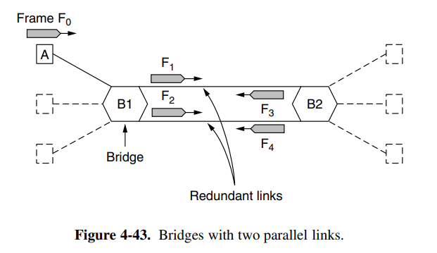
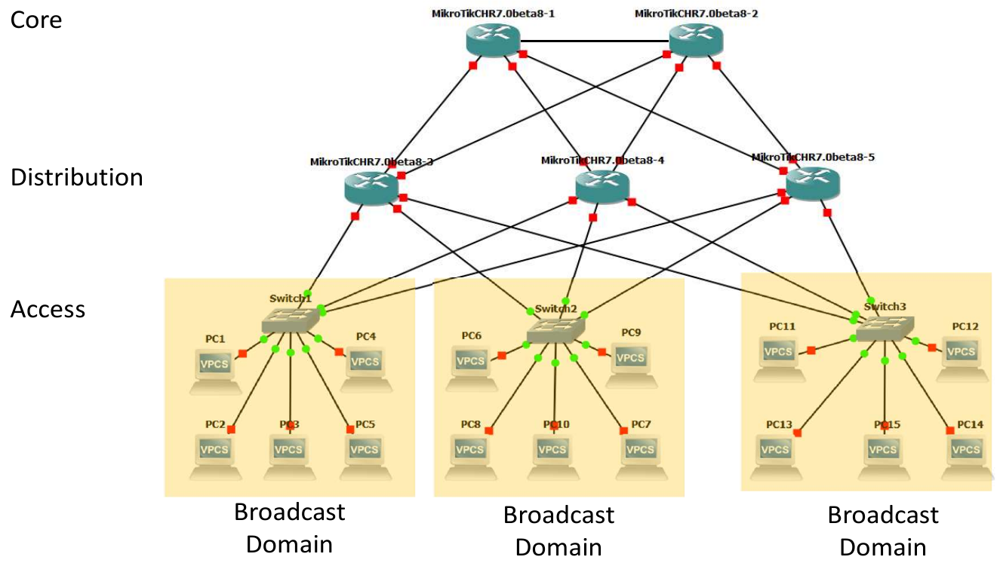
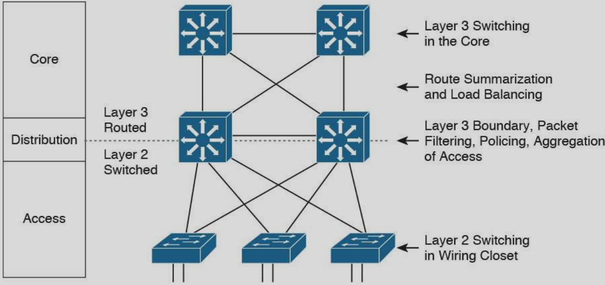
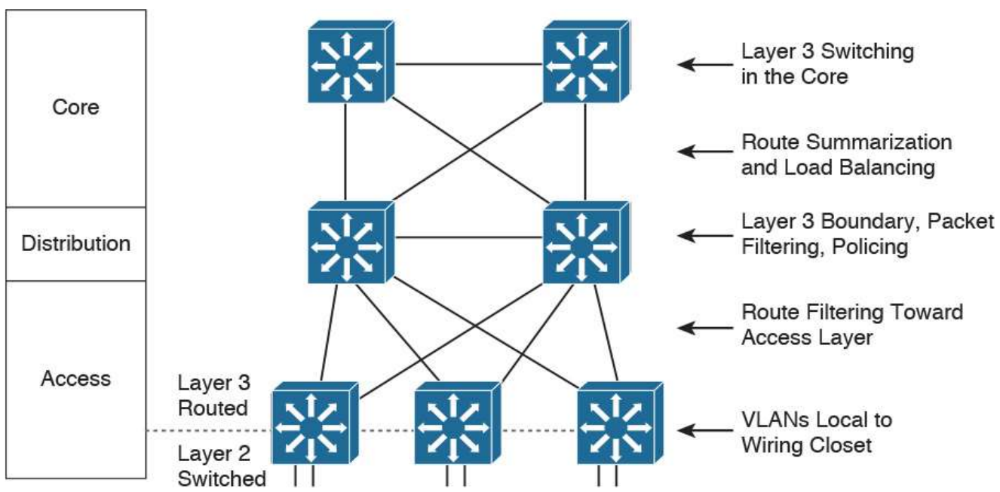
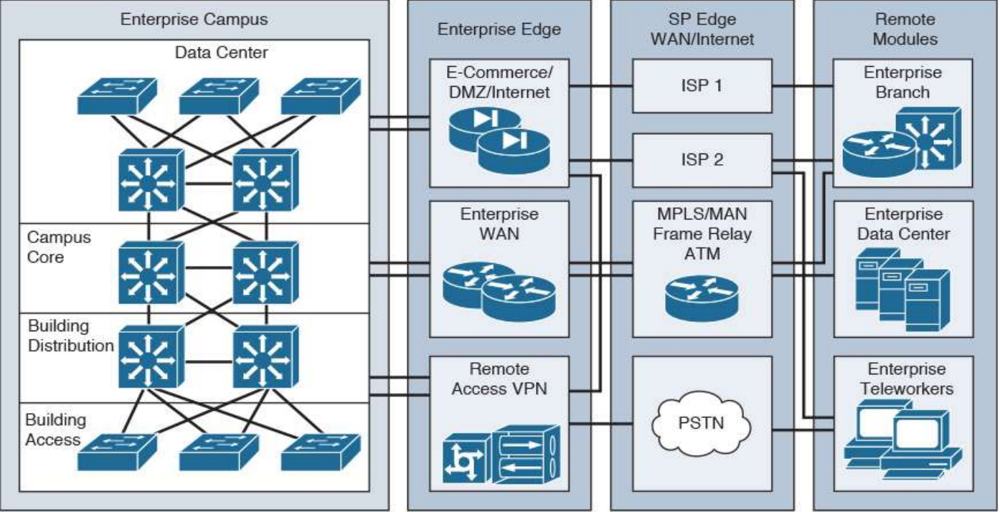

<!----------
title: "Rechnernetzadministration/Verteilte Systeme"
date: "Semester 5"
keywords: [Rechnernetzadministration, Verteilte Systeme, NET, DHGE, Semester 5]
header-includes:

  - \usepackage{enumitem}
  - \setlistdepth{20}
  - \renewlist{itemize}{itemize}{20}
  - \renewlist{enumerate}{enumerate}{20}
  - \setlist[itemize]{label=$\cdot$}
  - \setlist[itemize,1]{label=\textbullet}
  - \setlist[itemize,2]{label=--}
  - \setlist[itemize,3]{label=*}

---------->

Rechnernetzadministration/Verteilte Systeme
===========================================

<!-- md2apkg ignore-card -->

<!-- START doctoc generated TOC please keep comment here to allow auto update -->
<!-- DON'T EDIT THIS SECTION, INSTEAD RE-RUN doctoc TO UPDATE -->
**Inhaltsverzeichnis**

- [Rechnernetzadministration/Verteilte Systeme](#rechnernetzadministrationverteilte-systeme)
- [Literaturempfehlung](#literaturempfehlung)
- [Einleitung](#einleitung)
  - [Designziele](#designziele)
  - [Wiederholung Grundlagen](#wiederholung-grundlagen)
    - [Netzwerk](#netzwerk)
    - [Klassifizierung von Datennetzen](#klassifizierung-von-datennetzen)
      - [Räumliche Ausdehnung](#räumliche-ausdehnung)
      - [Größe/Anzahl der Teilnehmer](#größeanzahl-der-teilnehmer)
      - [Hardware-Sicht](#hardware-sicht)
      - [Logische Sicht](#logische-sicht)
        - [ISO/OSI und TCP/IP](#isoosi-und-tcpip)
      - [Topologie-/Struktursicht](#topologie-struktursicht)
      - [Logische Struktur](#logische-struktur)
      - [Einschub: Frames/Sicherungsschicht](#einschub-framessicherungsschicht)
        - [Grober Aufbau eines Frames](#grober-aufbau-eines-frames)
        - [Paketkollision](#paketkollision)
      - [Einschub: Geräte](#einschub-geräte)
    - [Topologien auf der logischen Ebene](#topologien-auf-der-logischen-ebene)
      - [flache Topologie](#flache-topologie)
      - [standortbasiert](#standortbasiert)
      - [funktionsgruppenbasierte Topologie](#funktionsgruppenbasierte-topologie)
      - [Overlay-Netzwerke](#overlay-netzwerke)
      - [VLAN](#vlan)
      - [Spanning Tree](#spanning-tree)
- [Link-Aggregation/Trunking](#link-aggregationtrunking)
- [Prinzipien einer strukturierten Herangehensweise](#prinzipien-einer-strukturierten-herangehensweise)
  - [Three Layer Hierarchisches Design (Hallo, Cisco)](#three-layer-hierarchisches-design-hallo-cisco)
    - [Access Layer](#access-layer)
      - [Aufgaben und Eigenschaften vom Access Layer](#aufgaben-und-eigenschaften-vom-access-layer)
    - [Distribution Layer](#distribution-layer)
      - [Aufgaben und Eigenschaften vom Distribution Layer](#aufgaben-und-eigenschaften-vom-distribution-layer)
    - [Core Layer](#core-layer)
      - [Aufgaben und Eigenschaften vom Core Layer](#aufgaben-und-eigenschaften-vom-core-layer)
    - [Two-Tier Collapsed Core Design](#two-tier-collapsed-core-design)
    - [Switched Hierarchical Design](#switched-hierarchical-design)
    - [Routed Hierarchical Design](#routed-hierarchical-design)
    - [Virtuelle Zusammenfassung von Switches](#virtuelle-zusammenfassung-von-switches)
- [Architekturen für große Netze](#architekturen-für-große-netze)
  - [Enterprise Campus](#enterprise-campus)
  - [Enterprise Edge](#enterprise-edge)
  - [Kritikpunkte am 3-Ebenen-Modell](#kritikpunkte-am-3-ebenen-modell)
- [SNMP/Netzwerk Management](#snmpnetzwerk-management)
  - [SNMP](#snmp)
  - [Netzwerkmanagement](#netzwerkmanagement)
    - [Wie mache ich Management?](#wie-mache-ich-management)

<!-- END doctoc generated TOC please keep comment here to allow auto update -->

<!--newpage-->

# Literaturempfehlung

<!-- md2apkg ignore-card -->

- Saida Helali: Systems and Network Infrastructure Integration
- J. Scott Marcus: Designing Wide Area Networks and Internetworks
- Jeff Bollinger: Crafting the InfoSec Playbook
- Tanenbaum: Computer Networks
- Douglas R. Mauro: Essential SNMP
- Thomas A. Limoncelli: The Practice of System and Network Administration

# Einleitung

## Designziele

- **Funktional:** Erfüllung der Anforderungen im Lastenheft $\rightarrow$ Benutzer können ihre Arbeit unter optimalen Bedingungen erfüllen
- **Ausbaufähig:** Wachstum muss möglich sein
- **Wartbarkeit:** von der Entwurfsphase an muss einfache Wartung/Betrieb eingeplant werden $\rightarrow$ Doku
- **Adaptivität:** Anpassung an neue Technologien

## Wiederholung Grundlagen

### Netzwerk

- besteht aus Hard- und Software
- durch kabelgebundene und/oder drahtlose Übertragungssysteme verbunden
- zur Übertragung/Verarbeitung von Informationen
- digitale Datennetze (es sollen keine Rundfunknetze und Telefonnetze behandelt werden) \rightarrow\rightarrow NGN (Next Generation Networking)

### Klassifizierung von Datennetzen

- Topologien/Strukturen
- Größe/Leistungsfähigkeit (Anzahl Clients)
- Übertragungmedium
- Anwendungsbereich: Protokollebene (Heterogen/Homogen)
- Hard-/Software
- Räumliche Ausdehnung (LAN, WAN, etc.)
- Betriebsmodus (Client-Server, Peer-to-Peer)

#### Räumliche Ausdehnung

- **PAN:** Personal Area Network, Reichweite *1m-10m* (bspw. Bluetooth)
- **LAN:** Local Area Network, Reichweite *10m-1km*
- **MAN:** Metropolitan Area Network, Reichweite *1-100km*
- **WAN:** Wide Area Network
- **GAN:** Global Area Network

#### Größe/Anzahl der Teilnehmer

- klein: ~200 Teilnehmer
- mittel: ~1000..2000 Teilnehmer
- groß: >2000 Teilnehmer

#### Hardware-Sicht

- Endgeräte (PC, Handy, Telefon, Server, Drucker, IoT, Management-Stationen)
- Kopplungsgeräte (Switch, Firewall, Repeater, Router, Bridge, Hub, Modem, Access-Point)
- Übertragungsmedien (Kabel, Funk)

#### Logische Sicht

##### ISO/OSI und TCP/IP

| Schicht                | Funktion                                                     | Protokolle | TCP/IP                          |
| ---------------------- | ------------------------------------------------------------ | ---------- | ------------------------------- |
| Anwendungsschicht      | Kommunikation zw. Anwendungen                                | NFS, DNS,  | Anwendungungsschicht            |
| Darstellungsschicht    | Transformation zw. Datenformaten, Verschlüsselung            | DHCP, HTTP | Anwendungungsschicht            |
| Sitzungsschicht        | Dialogsteuerung, Synchronisation                             | FTP, ...   | Anwendungungsschicht            |
| Transportschicht       | Ende-zu-Ende-Kommunikation zw. Prozessen                     | TCP, UDP   | Transportschicht                |
| Vermittlungsschicht    | Wegewahl Sender -> Empfänger, Kopplung heterogener Teilnetze | IP         | Internetschicht                 |
| Sicherungsschicht      | Behandlung von Übertragungsfehlern                           | Ethernet   | Netzzugangsschicht (Link Layer) |
| Bitübertragungsschicht | physikalische Ebene -> Übertragung von Signalen              |            | Netzzugangsschicht (Link Layer) |

#### Topologie-/Struktursicht

- ~~**Bus**~~ (in LV nicht betrachtet)
- **Stern** (Switch verbunden zu Host 1..n; Routerverbunden zu  Switch 1..n)
  - *nicht nur in Geräten denken, sondern allgemein in Strukturen*
  - Vorteil: schöne Struktur (leicht verständlich, wartbar), kostengünstig
  - Problem: Zentrale (Router, Switch) ist SPOF
- Lösung Redundanz: Stern aufbrechen $\rightarrow$ mehrere kleinere Sterne, redundant verbunden
  - $\rightarrow$ SPOF nicht mehr katastrophal, weniger Langstreckenverkehr
- **Ring:** weitere Redundanzen durch ringförmige Verbindungen der Zentralen (früher bereits leitungsvermittelt: SoNET/SDH $\rightarrow$ Telekom)
  - jede Einheit ist mit zwei anderen verbunden
    - Vorteil: einzelne Verbindung kann ausfallen, Kommunikation weiterhin möglich
    - Nachteil: hohe Kosten, schwerer wartbar (Strukturänderungen)
- **Mesh:** Verknüpfung von Ringen und Sternen (Teilvermascht)

#### Logische Struktur

- logische Struktur kann nicht in Übereinstimmung mit der physischen Struktur entworfen werden
- wird beeinflusst von Unternehmensstruktur, Zugang zu Diensten, Verzeichnisdienst
- z.B. flaches L2-Netz: eine Broadcast-Domäne, kein Router
  - Overlay: logische Struktur über physikalischen Netz $\rightarrow$ **VLAN** (IEEE 802.1q)

#### Einschub: Frames/Sicherungsschicht

- Bereitstellung einer wohldefinierten Schnittstelle zur Vermittlungsschicht
- Umgang mit Übertragungsfehlern
- Kommunikation zwischen benachbarten Hosts
- Regulierung des Datenflusses (Flow-Control)

$\rightarrow$ zur Erfüllung dieser Aufgaben: **Bildung von Frames/Rahmen**

##### Grober Aufbau eines Frames

```text
┌────────┬─────────┬─────────┐
│ Header │ Payload │ Trailer │
└────────┴─────────┴─────────┘
```

- Header: Verwaltungsinformationen (z.B. Infos zu Sender/Empfänger)
- Payload: Daten der höheren Schicht
- Trailer: Prüfsummen
- Frames sind je nach Implementierung unterschiedlich

##### Paketkollision

- zwei Teilnehmer senden zur gleichen Zeit Frames über ein geteiltes Medium (bspw. Bus oder Funk (bei gleicher Frequenz))
- Verhinderung mithilfe von CSMA/CD (Carrier Sense Multiple Access/Collision Detection) oder anderen Multiplex-Verfahren
- Collision-Domain $\rightarrow$ Bereich, in dem Kollisionen auftreten können
  - solche Domains sollten klein sein
  - keine Busse bauen
- Switches sollten duplex sein (heute eigentlich immer der Fall)

- Simplex (A $\rightarrow$ B; nur in eine Richtung)
- Halbduplex (A $\leftrightarrow$ B; Zwei-Wege-Kommunikation, aber nicht gleichzeitig)
- Vollduplex (A $\leftrightarrow$ B; gleichzeitige Zwei-Wege-Kommunikation)

#### Einschub: Geräte

| Layer               | Gerät                                            |
| ------------------- | ------------------------------------------------ |
| Anwendungschicht    | Application-Gateway                              |
| Transportschicht    | Transport-Gateway                                |
| Vermittlungsschicht | L3-Switch, Router                                |
| Sicherungsschicht   | Switch                                           |
| Bitübertragung      | Repeater, Kopplungselemente (Hub), (Kabel, Funk) |

- **Firewall:**
  - traditionell auf L3, bei Deep-Packet-Inspection etc. heute jedoch auch auf anderen Ebenen
  - besteht aus: Router + Application Layer Gateway + Router
- **Repeater:** analoges Gerät (analog = Zeit- und Wertkontinuierlich)
  - arbeitet mit Signalen auf Kabeln bzw. Funkstrecke
  - empfängt, bereinigt, verstärkt und sendet Signale
  - i.d.R. begrenzte Anzahl durch Latenz
- **Hub:** elektrische Verbindung mehrerer Leitungen <!-- dicker Lötklecks :D -->
  - angeschlossene Geräte sind Mitglieder der gleichen Kollision-Domäne
  - Anbindung aller Teilnehmer mit der gleichen Geschwindigkeit erforderlich
- **Bridge:** verbindet zwei/mehrere LANs (z.B. WLAN mit kabelgebundenem LAN $\rightarrow$ Access-Point)
  - Trennung der Kollisionsdomänen
  - Frames werden nur an Port gesendet, für deren angeschlossene Teilnehmer die Frames relevant sind
  - gleichzeitig ankommende Frames werden gepuffert (Kollisionsvermeidung, Geschwindigkeitsanpassung)
  - Kopplung von LANs mit verschiedenen Protokollen
  - Problem: z.B. Dienstgüte, Verschlüsselung unterschiedlich
- **Switch:** Bridge mit anderem Namen
  - mit zusätzlichen Point-to-Point Anbindung der Teilnehmer
- **Router:** Payload wird aus Frame entpackt und in Routing-SW verarbeitet
  - wirft Header und Trailer weg und kümmert sich lediglich um den Payload
  - L2-Payload wird an die Routing Software übergeben
  - Routing-Software wählt Ausgangsport aus
- **Transport-Gateway:** Umsetzung zwischen verschiedenen Protokollen auf der Transportebene
- **Application-(Level)-Gateway:** Umsetzung zwischen verschiedenen Protokollen auf der Anwendungsebene
  - bspw.: SIP $\leftrightarrow$ H.323, E-Mail $\leftrightarrow$ SMS

### Topologien auf der logischen Ebene

#### flache Topologie

<!--width=600px-->

- PC1, PC2 und PC3 sind mit Switch1 verbunden
- flache Topologie
- großes Netzwerk aller Layer2 Geräte
- Switch ist SPOF
- kein Routing
- eine Broadcast-Domain
- ein Subnetz
- Dienste (Datei-/Druck-/Namensauflösungs-/Email-/Dienste) werden in diesem Netz bereitgestellt

#### standortbasiert

<!--width=600px-->

- Schicht-2-Netzwerke basierend auf dem Standort
- L3-Geräte, um die L2-Netze zu verbinden
- jedes Stockwerk/L2-Netz hat einen eigenen L3-Adressblock

#### funktionsgruppenbasierte Topologie

<!--width=600px-->

- Mitglieder einer Funktionsgruppe (= Abteilung) in jeweils eigenem L2-Netz (Gruppennetzwerke)
- Dienste teils auf Gruppen-Ebene (Anmeldung, Dateien, ...
- andere Dienste(bspw. E-Mail/Internet) zentral
- teils hierarchische Struktur der Dienste (bspw. Anmelde-Server)

#### Overlay-Netzwerke

- Entkopplung der physischen von der logischen Struktur
- logische Struktur, die auf der physischen aufbaut
- VLAN, VPN(, Framerelay, ATM)
- **Gründe für Separierung von L2-Netzen:**
  - Organisationsstruktur passt nicht zur physischen Verkabelung/Struktur
  - Belastung/Load: Trennung von verschiedenem Netzwerkverkehr
  - Minimierung von Broadcast-Traffic (z.B. ARP)

#### VLAN

- virtuelle LANs schaffen, die in Software konfiguriert werden können

**Vorgehensweise zur Einrichtung:**

- Namen der Netzwerke (Farbe)
- Anzahl der VLANs
- Welcher Host soll in welche VLANs?

**Voraussetzungen für VLAN an den Bridges:**

- Tabelle in den Bridges: Zuordnung VLANs zu Ports
- Port kann zu mehreren VLANs gehören
- in den Paketen muss die Information stehen, zu welchem VLAN ein Paket gehört
  - 802.3 Ethernet Header musste erweitert werden $\rightarrow$ 302.1Q
  - Dauer der Ethernet-Frame-Änderung: 3 Jahre; wichtige Fragen:
    - Was passiert mit alter Hardware?
    - Wie/wo werden die zusätzlichen Felder eingefügt/weggenommen?
    - Was passiert mit Rahmen, die schon die maximale Größe haben?

**Variante 1:**

VLAN-Felder werden an Bridges verwendet, hinzugefügt oder weggenommen!

**Variante 2:**

Endgeräte sind 802.1Q-fähig und können VLAN-Felder befüllen/interpretieren

> Mischformen sind auch möglich

1\. V-LAN fähige Bridge fügt VLAN-Information hinzu, letzte Bridge vor dem (nicht VLAN-fähigen) Host entfernt sie (wenn nicht getagged angeliefert)

**Zusätzliche Felder im Ethernet-Header:**

- **VLAN protocol ID:** 0x8100 $\rightarrow$ größer als maximale Länge eines Frames (1500)
  - wird damit dazu führen, dass fälschlich empfangene VLAN-Frames von Legacy Hardware verworfen werden
- **Pri:** Priorität; ist im VLAN Header aber hat nichts damit zu tun
  - harter/weicher/nicht-Echtzeitverkehr
- **CFI:** Canonical Format Indicator; hat keine relevante Information
- **VLAN Identifier:** 12 Bit $\rightarrow$ 4096 Netze

#### Spanning Tree

> Klausurrelevant! (grob erklären können)

<!--width=600px-->

1. Frame f0, von Host A an unbekanntes Ziel
2. B1 flutet dieses Paket über alle Ports (außer Quellport) $\rightarrow$ 2 Kopien auf dem Weg zu B2: F1, F2
3. B2 erhält Kopien und sendet sie an den jeweils anderen Ports wieder aus $\rightarrow$ F1 $\rightarrow$ F4, F2 $\rightarrow$ F3
4. Pakete kreisen ewig $\rightarrow$ Lösung: Es geht um Redundanz, nicht Kapazitätserhöhung $\rightarrow$ eine Verbindung bleibt erhalten, der Rest wird abgeschaltet

- Redundanzen im Netzwerk $\rightarrow$ 2 Verbindungen sind besser als eine
  - $\rightarrow$ Probleme mit Flooding/Weiterleitung von Paketen für unbekannte Ziele
- Pakete haben keine festgelegte Lebensdauer $\rightarrow$ gehen endlos im Kreis
- Konstruktion einer schleifenfreien Topologie
- Netzwerk ist theoretisch Graph, Bridges sind Knoten, Verbindungen sind Kanten
- mit Spannung-Tree wird Graph in einen Baum umgewandelt (da schleifenfrei)
- Algorithmus: Spanning-Tree
- Herausforderung: Wurzel finden
- Austausch von Konfigurationsnachrichten zwischen den Bridges (werden nicht weitergeleitet (Schleifenbildung!))
- Auswahl der Wurzel des Baumes ist das Ziel dieser Konfigurationsnachricht
- dazu ist ein eindeutiges Merkmal notwendig, das finden wir in der Mac-Adresse
- niedrigste Kennung (=Mac-Adresse) wird als Wurzel festgelegt
- Position von Bridges im Baum (Ebene) wird über die Entfernung bis zur Wurzel (Anzahl Hops) festgelegt
- Ports, die nicht zum kürzesten Pfad gehören, werden abgeschaltet

**Abhängigkeiten VLAN/STP:**

- jedes VLAN benötigt seinen eigenen Spanning-Tree
- Broadcast-Traffic soll in VLAN bleiben
- Schleifen in VLANs sind zu vermeiden
- **verschiedene** VLANs können Schleifen bilden
- Konnektivität für seperate VLANs muss auch bei Ausfall möglich sein (solange physische Verbindung vorhanden)

# Link-Aggregation/Trunking

- Zusammenfassung von Links
- Zweck: Steigerung der Bandbreite
- zunächst Herstellerspezifisch, dann (2000) iEEE 802.3ad
- jetzt bei 802.1ax
- sowohl statisch als auch dynamisch konfigurierbar
- Protokoll: LACP (Link Aggregation Control Protocol)
- aktiv: Senden von entsprechenden Kontrollnachrichten
- passiv: nur Reaktion auf Kontrollnachrichten

# Prinzipien einer strukturierten Herangehensweise

- Hierarchie aufbauen
- Modularität für einfache Erweiterbarkeit
- Ausfallsicherheit, aber abwägen, wo es wirklich wichtig ist
- Flexibilität für einfache Änderungen
- Sicherheit nach außen und innen

## Three Layer Hierarchisches Design (Hallo, Cisco)

<!--width=600px-->

- besteht aus Core-, Distribution- und Access-Schicht
- jeder Access-Switch kann eine eigene Broadcast-Domäne darstellen, wenn auf der Distribution-Schicht Router verwendet werden

### Access Layer

- verbindet Endgeräte wie PCs, Drucker, IoT-Geräte
- bietet Zugang zum Netzwerk

#### Aufgaben und Eigenschaften vom Access Layer

- Rate-Limiting
- Layer 2 Switching
- Power over Ethernet
- Broadcast-Filterung
- Quality-of-Service Markierungen
- Port-Sicherheit
- Zertifikatsbasierter Zugang
- STP und VLAN

### Distribution Layer

- Teil- oder Voll-Vermaschung
- Abstraktion zwischen Access- und Core-Schicht
- hier könnte Ihr Router (oder L3-Switch) stehen (Routing bietet sich in dieser Schicht an)
- Paketfilter bieten sich in dieser Schicht an

#### Aufgaben und Eigenschaften vom Distribution Layer

- Paketfilterung
- erstmalig Routing
- Redundanz
- Quality of Service
- VxLAN
- verbindet Netze, routet Pakete
- Lastausgleich
- trennt oder verbindet Broadcast-Domänen
- Richtlinien (Policy)
- Aggregation LAN/WAN/Adressbereiche
- Zugriffssteuerung

### Core Layer

- (teure) Router
- Access Control
- Fehlertoleranz sowohl geräteintern als auch durch Redundanz
- Routen-Verwaltung

#### Aufgaben und Eigenschaften vom Core Layer

- Schneller Transport
- Hohe Zuverlässigkeit
- Redundanz/Ausfallsicherheit
- Fehlertoleranz
- Niedrige Latenz
- CPU Last
- Quality of Service
- Hop Count

### Two-Tier Collapsed Core Design

- wie [Three Layer Hierarchisches Design](#three-layer-hierarchisches-design-hallo-cisco) aber:
- ohne Distribution-Ebene
- Access-Switches sind direkt mit Core-Routern vollvermascht

### Switched Hierarchical Design

<!--width=600px-->

Bild: Cisco

### Routed Hierarchical Design

<!--width=600px-->

Bild: Cisco

### Virtuelle Zusammenfassung von Switches

- erlaubt es, alle Upstream Links zu nutzen, welche normalerweise durch STP gesperrt werden würden, um die Bandbreite zu erhöhen

# Architekturen für große Netze

<!--width=600px-->

Bild: Cisco

## Enterprise Campus

- Data Center
- Campus Core
- Building Distribution
- Building Access

## Enterprise Edge

ist der Übergang nach draußen.

- E-Commerce
- DMZ/Internet
- Enterprise WAN
- Remote Access VPN
- Anbindung von Service Provider Edge und Enterprise Edge
- Zur Erhöhung der Leistung und Ausfallsicherheit, brauche ich mehr Anbindungen zum ISP $\rightarrow$ mehr Edge-Router (auf einer oder beiden Seiten)
  - Mehrere ISPs sind auch möglich
- Enterprise Edge ist der Übergang nach draußen und drinnen
- verbindet mehrere Standorte miteinander

## Kritikpunkte am 3-Ebenen-Modell

- **Skalierbarkeit:**
  - Hardware: nicht genügend Ports etc.
  - VLAN: nur 4096 Netze
  - STP; insbesondere in Kombination mit Aggregation
  - Broadcast-Traffic (z.B. durch ARP (für IPv6 im Bereich von 10..20s), Flooding)
- **Komplexität:**
  - zusätzliche Protokolle, um Einschränkungen zu beheben (VxLAN, STP, MST, ...)
- **Blast Radius:** Was wird durch einen Fehler noch in Mitleidenschaft gezogen?
- **Berechenbarkeit/Vorhersagbarkeit:** Das Netz verhält sich unter Randbedingungen ggf. unberechenbar, z.B.: Broadcast-Flut, STP-Versagen
- **Inflexibel:**
  - (Bild) VLAN z.B. nur lokal in einem Pod $\rightarrow$ Hilfsmittel VxLAN $\rightarrow$ Komplexität
- **Agilität:** virtuelle Netze müssen schnell bereitgestellt werden $\rightarrow$ VLAN $\rightarrow$ STP

$\rightarrow$ Kritikpunkte sind teils adressierbar durch eine Änderung der Topologie

$\rightarrow$ weniger Ebenen, mehr Vermaschung, mehr Routing (Idee kommt aus der Leitungsvermittlung, wieder entdeckt von Charles Clos in den 50er Jahren)

$\rightarrow$ wird als Clos oder Spine-Leaf bezeichnet

- Spine $\rightarrow$ andere Bezeichnung für Backbone
- jedes (Leaf-)Node ist mit jedem (Spine-)Node verbunden $\rightarrow$ voll vermascht
- Leafs sind untereinandner **nicht** verbunden
- Spine-Nodes sind untereinander **nicht** verbunden
- "Top of Rack (ToR) Switch" ist ein Switch, der als Leaf ein Rack mit dem Spine verbindet
- Frage nach der Kapazität: mehr Spines (mehr Links) $\rightarrow$ STP?

**Aufgabentrennung:**

- Leaves: Anbindung der Endpunkte
- Spine: Verbinden Leaves miteinander: mehr Spines $\rightarrow$ mehr Durchsatz (statt Kauf des nächsthöheren Core-Routers)

$\rightarrow$ Wir realisieren den Datenaustausch hauptsächlich per Routing, kein STP zwischen Leafs und Spine,
L2 Bridging bleibt in Richtung der Endgeräte möglich

- VLANs sind zunächst auf den Bereich eines Leafs beschränkt $\rightarrow$ VxLAN
- alternativ z.B.: TRILL (IETF), SPB (IEEE)
- Kostenfunktion: gleiches Gewicht für alle Pfade
- Frage der Auslastung von NW-Verbindungen:
  - Subscription Ratio = Bandbreite down / Bandbreite up

# SNMP/Netzwerk Management

## SNMP

- **SNMP:** **S**imple **N**etwork **M**anagement **P**rotocol
- Protokoll, das Informationen von Geräten/Diensten im Netzwerk abholt (1988)
- Menge an Operationen zur Abfrage des Status und/oder Änderung des Status von Geräten im Netzwerk
- standardisiert von der IETF: RFC1157 (Version 1)
- die aktuellste Version 3 hat sich noch nicht überall durchgesetzt
- Version 2 ist am meisten verbreitet

**Manager:**

- Server, auf dem die Management-Software läuft
- NMS: Network Management Station
- pollt die Agents nach Traps $\rightarrow$ Art und Weise, auf die der Angefragte Bescheid gibt, dass Informationen vorliegen

**Agent:**

- sendet Traps asynchron
- Software, die auf zu verwaltenden Geräten läuft

**Ablauf:**

1. Ereignis tritt beim Agent ein
2. Agent sendet Trap an NMS
3. NMS sendet Query an Agent
4. Agent reagiert auf die Query, mit Nachricht an NMS

**Frage:** "Welcher Agent kann was/hat welche Fähigkeiten?"

- **SMI:** Struktur of Management Information
  - definiert managed Objekte und deren Verhalten
- **MIB:** Management Information Base

**MIB-$\textrm{II}$:** <!--🔥😈🔥--> Informationen zur Netzwerkschnittstelle (MTU, Geschwindigkeit, Menge Transfer Daten), Ort, Kontaktdaten

- MIB-$\textrm{II}$ muss implementiert sein und andere können implementiert werden
- **RMON:** Remote Monitoring
  - V1: Paketstatistik für Netzwerk
  - V2: Paket & Applikationsstatistik
  - kann dann zum NMS weitergeleitet werden
  - dazu: Probe: sammelt erforderliche Daten und sendet diese an NMS; hat MIB

## Netzwerkmanagement

**FCAPS:** ISO-Standard für Netzwerkmanagement

- **F**ault Management: Fehlererkennung, Fehlerlogging, Benachrichtigung der Nutzer
  - 3 Schritte zur Behebung:
    1. Diagnose/Eingrenzung
    2. Problembehebung
    3. Dokumentation (Schritte zur Problemlösung)
- **C**onfiguration Management: Überwachung des Netzwerks, Sammeln von Informationen zur Konfiguration
  - Versionen von Betriebssystemen, Firmware, Software
  - Interfaces (Geschwindigkeit, Auslastung, Anzahl)
  - Prozessoren, Speicher, HDD...
- **A**ccounting Management: Netzwerk/Rechner-ressourcen "fair" nutzen
- **P**erformance Management: Leistungsdaten erheben und auswerten
  - Dazu 3 Schritte:
    1. Daten erheben
    2. Normalzustand/Baseline ermitteln
    3. Warnschwellen einrichten
- **S**ecurity Management:
  1. Zugriffsbeschränkung
  2. Zugriffsüberwachung
  - $\rightarrow$ z.B. Firewall, IPS, AV, WU, Policies $\rightarrow$ physische Sicherheit

### Wie mache ich Management?

**Aktivitätslevel:**

- inaktiv: kein Monitoring, keine Handlungsaktivität
- reaktiv: kein Monitoring, wenn Symptone $\rightarrow$ dann Reaktion
- interaktiv: Monitoring, dann Handeln (Troubleshooting)
- proaktiv: Monitoring, nicht nur problembezogen, sondern mit Ursachen (Sahnehäubchen: Automatische Fehlerbehebung)
  - Trendanalyse: proaktive Aktität hängt von Monitoring und Analyse der Daten ab
  - Latenzen/Antwortzeiten im Blick behalten
  - Fehlerbehebung: detaillierte (aber nicht zu detaillierte) Fehlermeldungen
