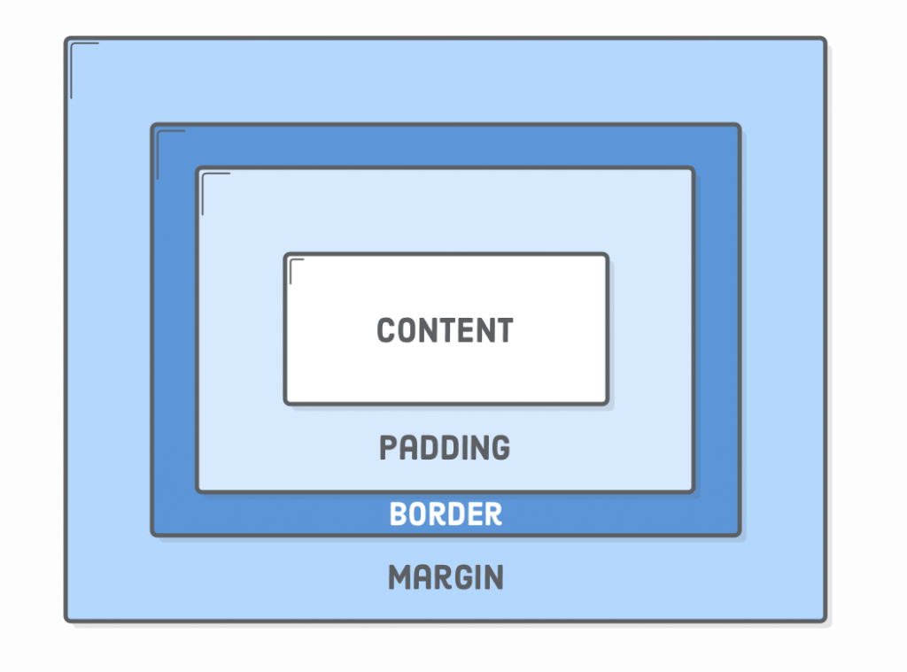

- [Technologien für Web-Anwendungen](#technologien-für-web-anwendungen)
- [HTML](#html)
  - [Grundgerüst](#grundgerüst)
  - [Head](#head)
  - [Links](#links)
  - [Listentypen](#listentypen)
  - [Tabellen](#tabellen)
  - [Formulare](#formulare)
    - [Input](#input)
    - [Select](#select)
    - [Formular-Beispiel](#formular-beispiel)
  - [Universalattribute](#universalattribute)
- [CSS](#css)
  - [Farben](#farben)
  - [Box Model](#box-model)
  - [Einheiten](#einheiten)
  - [Selectoren](#selectoren)
    - [Attributselektoren](#attributselektoren)
    - [Pseudoklassen](#pseudoklassen)
    - [Pseudoelemente](#pseudoelemente)
    - [Verbundsselektoren](#verbundsselektoren)
  - [`display` Eigenschaft](#display-eigenschaft)
    - [`inline` Box](#inline-box)
    - [`block` Box](#block-box)
    - [`flex` Box](#flex-box)
    - [`grid`](#grid)
      - [Grid Beispiel](#grid-beispiel)
  - [Media Queries](#media-queries)
  - [Ein paar Attribute...](#ein-paar-attribute)
- [JavaScript](#javascript)
  - [Datentypen](#datentypen)
    - [komplexe Datentypen](#komplexe-datentypen)
  - [Operatoren](#operatoren)
  - [DOM - Document Object Model](#dom---document-object-model)
  - [Function Syntax](#function-syntax)
  - [Unterschied JavaScript & ECMA-Script](#unterschied-javascript--ecma-script)
  - [Variablen](#variablen)
    - [Klausur](#klausur)

# Technologien für Web-Anwendungen

- Definition Webanwendung: Anwendung, plattformunabhängig im Browser, nutzt HTTP
- HTML 5 $\rightarrow$ Hyper Text Markup Language $\rightarrow$ Auszeichnungssprache, Beschreibung der Struktur der Webseiten; Ursprung aus der Forschung
  - semantisches HTML: Gliedern der Webseite mit ``<header>``, ``<main>``, ``<aside>``, ...
- CSS 3 $\rightarrow$ beschreibt Formatierung/Aussehen, zusätzliche Effekte und Visualisierung
- Java /ECMA -Script $\rightarrow$ Interaktion, client-seitig ausgeführt
- DOM $\rightarrow$ Document Object Model $\rightarrow$ Manipulation des Seiteninhalts, Schnittstelle zwischen HTML und Javascript
  - Elementbaum wird manipuliert, gelesen, erweitert
  - jeder HTML-Tag ist ein Knoten unter dem Root-Element
- Ajax $\rightarrow$ dynamisches Nachladen von Inhalten vom Server
- XML $\rightarrow$ eXtensible Markup Language $\rightarrow$ Datenaustauschformat
- PHP $\rightarrow$ HTML-Präprozessor, wird serverseitig vor dem Ausliefern der fertigen HTML-Seite ausgeführt
  - Client erhält Ergebnis der Skriptausführung
  - kann in HTML eingebettet werden
  - Skriptsprache
  - "PHP: Hypertext Preprocessor"

# HTML

## Grundgerüst

```html
<!DOCTYPE html> <!-- Definition des Dokumententypens -->
<html lang="de">
    <head> <!-- Dateikopf -->
    </head>
    <body>
        <header></header>
        <nav></nav>
        <main>
            <article>
                Mit eigenem Header, Überschrift, Footer...
                <section>
                </section>
            </article>
        </main>
        <footer></footer>
        <aside></aside>
        <script src=""></script> <!--Skripte werden am Besten am Dateiende geladen-->
    </body>
</html>
```

## Head

```html
<meta charset="UTF-8">
<meta name="description" content="Seite">
<meta name="keywords" content="HTML, CSS">
<meta name="author" content="John Doe">
<link rel="stylesheet" href="styles.css">
<title>Titel</title>
```

## Links

- `a` $\rightarrow$ anchor aka Hyperlinks
- `href="dokument.html"` ODER `="#ziel"` ODER `="dokument#ziel"`
- `href=""` $\rightarrow$ Seite neuladen
- `href="#"` oder `href="#top"` $\rightarrow$ Seitenanfang
- `download` $\rightarrow$ bei href angegebene Datei soll heruntergeladen werden
- `target` $\rightarrow$ wo Linkziel öffnen
  - `_blank` $\rightarrow$ neue Seite bzw. Tab
  - `_self` $\rightarrow$ selbes Fenster
  - `_parent` $\rightarrow$ im Elternfenster
  - `_top` $\rightarrow$ im obersten Fenster

## Listentypen

- sortiert $\rightarrow$ `ol` > `li`
- unsortiert $\rightarrow$ `ul` > `li`
- Beschreibungsliste $\rightarrow$ `dl` > `dt`, `dd`

## Tabellen

- `<table>`
- Zeile: `<tr>`
- Zelle: `<td>`
- Kopfzelle: `<th>` (`scope`-Attribut: Zeilen- oder Spaltenkopf)
- Fußzeile: `<tfoot>`; Kopfzeile: `<thead>`
- Caption: `<caption>` Beschriftung oder Überschrift einer Tabelle (mittig darüber)
- `<colspan>`: verbindet Spalten
- `<rowspan>`: verbindet Zeilen
- `<colgroup>`: Gruppieren von Spalten

## Formulare

```html
<form action="/form_handler.php" id="form1" method="POST">
    <label for="name">Name:
        <input id="name" type="text" name="name" required>
    </label>
    ...
```

- `id` und `name` bestenfalls identisch halten
- `<fieldset>` $\rightarrow$ Formularelemente gruppieren $\rightarrow$ semantische Gliederung, hübscher Frame darum gezeichnet

### Input

- type: `text`, `email`, `tel`, `password`, `url`, `search`, `number`, `range`, `radio`, `checkbox`, `hidden`, `file`, `color`, `date`, `submit`, `reset`
- weitere Attribute: `maxlength`, `minlength`, `min`, `max`, `required`, `pattern`, `value`, `placeholder`

### Select

- sind Dropdown-Menüs
- Ausswahlliste in Formularen `<select>`
- Elemente innerhalb des Body mit `<option>`
- verschachtelte Auswahlliste `<optgroup>`
- Attribute: `name`, `size`, `multiple`
- Attribut für `<option>`: `selected`

### Formular-Beispiel

```html
<form id="annmeldSem5" name="annmeldSem5" method="GET" action="/form_handler.php" enctype="multipart/form-data">
  <label for="name">Name:
    <input name="vorname" id="name" maxlength="10" value="Hilde">
  </label>
  <label for="suche">Suchen:
    <input type="search" name="suche" id="suche"
      maxlength="10" placeholder="Suchbegriff" list="liste">
    <datalist id="liste">
      <option>HTML</option>
      <option>CSS</option>
    </datalist>
  </label>

  <fieldset id="sturi">
    <legend>Studienrichtung: </legend>
    <label for="pi">PI
      <input type="radio" name="sturi" id="pi" value="1">
    </label>
    <label for="wi">WI
      <input type="radio" name="sturi" id="wi" value="2">
    </label>
  </fieldset>

  <label for="sonder">Sonderheiten:
      <fieldset id="sonder" >
        <label for="polster">Polsterstuhl
          <input type="checkbox" name="sonder"
            id="polster" value="1">
        </label>
      </fieldset>
  </label>
  <br>

  <label for="zahlung">Zahlungsbeleg:
    <input type="file" id="zahlung" name="zahlung"
      multiple accept="image/*">
  </label>
  <BR>
  <label for="imaDat">Datum der Imatrikulation:
    <input type="date" id="imaDat" name="imaDat"
        min="1999-09-01" max="2050-12-31">
  </label>
  <br>

  <label for="anmerkungen">Anmerkungen: <br>
    <textarea cols="80" rows="20" name="anmerkungen" id="anmerkungen">Beispiel
    </textarea>
  </label>

  <br><br>
  <input type="submit" value="Senden">
  <input type="reset" value="Löschen">
</form>
```

## Universalattribute

- `id` $\rightarrow$ eineindeutig
- `class` $\rightarrow$ kann mehrmals vergeben werden
- `accesskey` $\rightarrow$ Taste zum Anspringen des Elementes
- `contenteditable` $\rightarrow$ Inhalt kann verändert werden
- `hidden` $\rightarrow$ Element ausgeblendet
- `draggable` $\rightarrow$ kann das Element gezogen werden?
- `lang` $\rightarrow$ Sprache für Elemente überschreiben
- `spellcheck` $\rightarrow$ browserinterne Rechtschreibprüfung aktivieren
- `style` $\rightarrow$ inline-css *(böse)*
- `tabindex` $\rightarrow$ Tabulatorreihenfolge, lfd. Nummer
- `title` $\rightarrow$ Elementbeschreibung

# CSS

- direkt am HTML-Element (inline $\rightarrow$ `style=""`)
- internes Stylesheet (`<style></style>`)
- externes Stylesheet einbinden (`<link rel="stylesheet" href="../style.css">`)

## Farben

- RGB: dezimal (dezimal `rgb(255, 0, 128)` oder prozentual `rgb(100%, 0%, 50%)`
- hexadezimal (`#ff0080`)
- Transparenz mit 2 Stellen mehr bei `hexa` & `rgba` (alpha Wert zwischen 0 und 1)#

## Box Model

<!--width=600px-->

- Content: The content of the box, where text and images appear
- Padding: Clears an area around the content. The padding is transparent
- Border: A border that goes around the padding and content
- Margin: Clears an area outside the border. The margin is transparent

## Einheiten

- physische Einheiten: Zoll (`in`), Zentimeter (`cm`), Pixel (`px`)
- relative Einheiten: `em` (Schriftgröße), `ex` (Höhe kleiner Buchstaben), `vw` (Viewportbreite), `vh` (Viewporthöhe), `vmin` & `vmax` (kleinerer/größerer Wert), `%`, `fr` (Anteile), `rem` (`em` relativ zum parent)
- Winkel: Grad (`deg`), Radiant (`rad`)
- Zeit: Sekunden (`s`), Millisekunden (`ms`)

## Selectoren

- Universalselektor $\rightarrow$ addressiert alles: `*`
- Typselektor $\rightarrow$ addressiert HTML-Element (`p`, `h1`, ...)
- Klassenselektor $\rightarrow$ beginnt mit Punkt (`.class`)
- ID-Selektor $\rightarrow$ beginnt mit Raute (`#id`)

### Attributselektoren

- Attribut existiert $\rightarrow$ `[Attributname]`
- Attribut hat Wert $\rightarrow$ `[name=wert]`
- Zeichenkette enthält Wert, durch Leerzeichen getrennt `[name~=wert]`
- Attributwert beginnt mit angegebener Zeichenkette, vom Rest mit Bindestrich getrennt `[name|=wert]`
- Teilübereinstimmung:
  - beginnt mit Zeichenkette $\rightarrow$ `[name^=wert]`
  - endet mit Zeichenkette $\rightarrow$ `[name$=wert]`
  - enthält Zeichenkette $\rightarrow$ `[name*=wert]`

### Pseudoklassen

- auf Eigenschaften der HTML-Elemente bezogen
- Bezogen auf Kindelemente: `:empty`, `:first-child`, `:last-child`, `:nth-child()`
- `:link` (alle NICHT besuchten), `:visited`, `:hover`, `:active`, `:focus`
- `:disabled`, `:enabled`, `:checked`
- `:valid`, `:invalid`, `:in-range`, `:out-of-range`

### Pseudoelemente

- beginnen mit `::`
- `::first-line`, `::first-letter`
- `::before`, `::after`
- `::backdrop`: Box mit Größe vom Viewport
- `::selection`, `::placeholder`

### Verbundsselektoren

- `p#id.classname[name=wert]::first-letter:hover`
- Kombinatoren:
  - Kindkombinator: `Element > Kind` z.B. `p > em` $\rightarrow$ genau eine Ebene darunter
  - Nachfahrenkombinator: `Element Kind` z.B. `p em` $\rightarrow$ beliebige Ebene darunter
  - Nachbarkombinator: `Element + Kind` z.B. `h1 + p` $\rightarrow$ Auf gleicher Ebene, was direkt daneben steht
  - Geschwisterkombinator: alle Elemente, die auf gleicher Ebene folgen z.B. `h1 ~ p` $\rightarrow$ alle, die auf der gleichen Ebene liegen

## `display` Eigenschaft

- `none` $\rightarrow$ Element wird nicht dargestellt und es wird kein Platz reserviert
- `hidden` $\rightarrow$ Element wird nicht dargestellt, aber es wird Platz reserviert
- `visible` $\rightarrow$ Element wird dargestellt und es wird Platz reserviert <!--was auch sonst-->

### `inline` Box

- bricht nichts um
- Images sind standardmäßig `inline`
- `display: inline`
- Breite der Box durch Inhalt bestimmt

### `block` Box

- `display: block`
- Anordnung untereinander
- gesamte Breite des Elternelements
- für viele Textelemente Standard

### `flex` Box

- `display: flex`
- `flex-direction: row | row-reverse | column | column-reverse`
- horizontale oder vertikale Ausrichtung

### `grid`

- `display: grid`
- `grid-template-columns`: legt Spalten & deren Aufteilung fest
- `grid-template-areas`: Bestimmung Zelle zu welchem Bereich gehört
- `grid-area`: Bereich festlegen, in dem ein Element angezeigt wird
- automatische Erzeugung
- `repeat(auto-fill, minmax(wert,wert))`
- Zuweisung der Zeilen/Spalten
  - `grid-row`: start/end
  - `grid-column`: start/end

#### Grid Beispiel

```css
body {
    font-family: Calibri, Times New Roman, Tahoma, sans-serif;
    display: grid;
    grid-template-columns: 1fr 2fr 2fr 1fr;
    grid-template-rows: 2fr 4fr 4fr 1fr;
    grid-template-areas:    "head head head head"
                            "nav main main aside"
                            "nav main main aside"
                            "foot foot foot foot";
}

header {
    grid-area: head;
}
```

## Media Queries

- Darstellung eines Dokumentes für verschiedene Ausgabemedien festlegen (rEspOnsIve DeSIgn)
- mit css `@media (max-width: 500px){/* some css for small screens */}`
- `@media print { /* some css for print layout */}`

## Ein paar Attribute...

- `z-index` $\rightarrow$ Ebenensystem
- `text-decoration`
- `justify-content` (Ausrichtung) `center | space-between | space-evenly | space-around | end | ...` <!--wäre bei display:flex sinnvoll-->
- `font-family` <!--weil das ja klar ist-->
- `transition: Attributname Dauer Art (linear, ease, ...)`
- `border: 1px solid|dotted|dashed black`
- `border-radius: 0 5px 2px 2px`
- `text-align`
- `order`

# JavaScript

- JavaScript-Engine
  - Chrome: V8
  - Firefox: SpiderMonkey
- Node $\rightarrow$ Nutzung von JS ohne Browser
  - erlaubt serverseitige Nutzung
  - z.B. Datenbankzugriffe, Kryptographie, kritische Systeme <!--😈-->
- z.B. To Do Liste, Button zum Einfügen eines Elementes
- Form `html` Tag mit ``"onsubmit=addTodo()"``

## Datentypen

- String, Number, Boolean, undefined, BigInt
- Array, Object, Function

## Operatoren

- klassische C-Operatoren
- ``**`` ist für das Potenzieren
- ``==`` $\rightarrow$ formatiert ggf. Datentypen um Gleichheit zu erreichen ``23 == '23'`` -> ``true`` (``!=``)
- ``23 === '23'`` $\rightarrow$ ``false`` (``!==``)

## DOM - Document Object Model

```javascript
document.getElementById(); // document.getElementById('div1')
document.getElementsByName();
document.getElementsByTagName(); // z.B. <p> --> document.getElementsByTagName('p')
document.getElementsByClassName(); // returnt viele
document.querySelector(); // gibt erstes Element, das dem angegebenen CSS-Selektor entspricht, z.B.: document.querySelector('#franz');
document.querySelectorAll(); // gibt alle Elemente, die dem angegebenen CSS-Selektor entsprechen
```

## Function Syntax

```javascript
// Zweck der Funktion: Klasse eines Elementes togglen (selector, class)
function toggleClass(selector, _class) {
  // Element aus DOM auswählen
  const el = document.querySelector(selector);
  // Abbruch, wenn kein passendes Element gefunden
  if (!el) return;
  // Besitzt das Element die Klasse?
  if (el.classList.contains(_class)) {
    // ja -> Klasse entfernen
    el.classList.remove(_class);
  } else {
    // nein ->Klasse hinzufügen
    el.classList.add(_class);
  }
}
```

## Unterschied JavaScript & ECMA-Script

- ECMA-Script $\rightarrow$ Scripting Language Specification
- JavaScript (& andere Scriptsprachen) $\rightarrow$ setzen diesen Standard um

## Variablen

```javascript
let variable; // undefined
variable = 2; // number
variable = 'string';
'use strict'; // strenger Modus
const variable = 45;
const Pi = 3.1415;
```

- ``let``: begrenzt Scope auf Block, dürfen nicht re-declared werden
- ``var``: function-Scope, global Scope
- ``const``: Block-Scope, nur einmal zuweisbar
- Bezeichner: eindeutig innerhalb des Scopes, beginnen mit Buchstabe, Unterstrich oder Dollar; case-sensitiv, dürfen keine anderen Sonderzeichen enthalten
